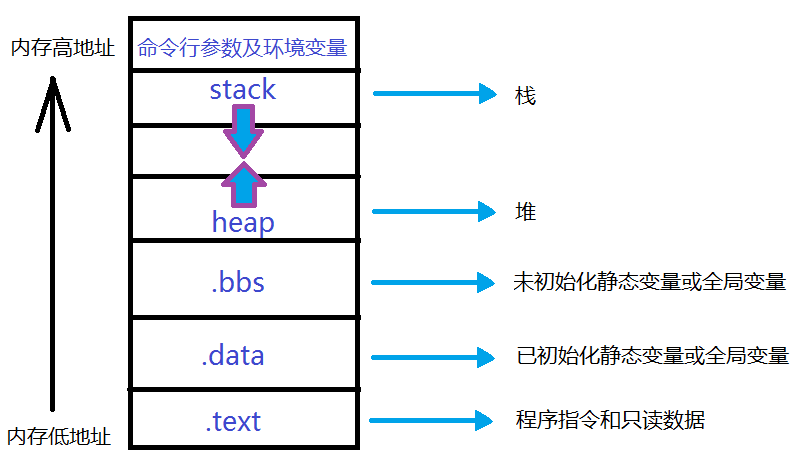

## Q1: c++static关键字

- 用于函数内部修饰变量，即函数内的静态变量。这种变量的生存期长于该函数，使得该函数具有一定的状态。使用静态变量的函数一般是不可重入的，也是线程不安全的。
- 在文件级别，修饰变量或函数，表示该函数或变量只在本文将可见，其他文件看不到也访问不到
- 修饰class的数据成员。这种数据成员的生存期大于class的对象。
- 修饰class的成员函数，这种函数智能访问类静态变量和其他静态程序函数

## Q2: 封装，继承，多态

- 封装：也就是把客观事物封装成抽象的类，并且类可以把自己的数据和方法只让可信的类或者对象操作，对不可信的进行信息隐藏。

- 继承：根据另一个类来定义一个类。`is a`

  - 派生类可以访问基类中的非私有成员

     |   访问   | public | protected | private |
     | :------: | ------ | --------- | ------- |
     | 同一个类 | yes    | yes       | yes     |
     |  派生类  | yes    | yes       | no      |
     | 外部的类 | yes    | no        | no      |

  - 继承类型：
    - public 继承： 当一个类派生自公有基类时，基类的公有成员也是派生类的公有成员，基类的保护成员也是派生类的保护成员，基类的私有成员不能直接被派生类访问，但可以通过调用基类的公有和保护成员来访问
    - protected 继承：当一个类派生自保护基类时，基类的公有和保护成员将成为派生类的保护成员
    - private 继承：当一个类派生自私有基类时，基类的公有和保护成员将成为派生类的私有成员
  - 多重继承
    
    - 多重继承： 一个子类可以由多个父类

- 多态：通过基类访问派生类定义的函数。多态性使得程序调用的函数实在运行时动态确定的，而不是编译时静态确定的。”一个接口，多种方法“

  - 多态的目的：相同对象收到不同消息或不同对象收到相同消息时产生不同的实现动作
  - C++ 支持两种多态性
    - 编译时多态性（静态）： 通过重载函数实现： 先期联编 early binding
      - 编译器编译期间可以确定函数调用的地址
    - 运行时多态性（动态）： 通过虚函数实现
      - 子类重新定义弗雷的做法称为覆盖（Override）


## Q3: 虚函数

- 虚函数： 在类成员方法的声明语句前加 `virtual`, `virtual void func()`
  - 子类可以（也可以不）重新定义基类的虚函数，该行为称之为复写（Override）
  - 当使用类的指针调用成员函数时，普通函数由指针类型决定，而虚函数由指针指向的实际类型决定
  - 通过对象内存中的虚函数指针vptr找到虚函数表vtbl，再通过vtbl中的函数指针找到对应虚函数的实现区域并进行调用
  - 虚函数指针和虚函数表
    - C++中虚函数使用虚函数表和 虚函数表指针实现，虚函数表是一个类的虚函数的地址表，用于索引类本身以及父类的虚函数的地 址，假如子类的虚函数重写了父类的虚函数，则对应在虚函数表中会把对应的虚函数替换为子类的 虚函数的地址；虚函数表指针存在于每个对象中（通常出于效率考虑，会放在对象的开始地址处）， 它指向对象所在类的虚函数表的地址；在多继承环境下，会存在多个虚函数表指针，分别指向对应 不同基类的虚函数表。
- 纯虚函数：在虚函数后加 `=0` 如 `virtual void func() = 0`
  - 子类必须提供虚函数的个性化实现
  - 含有纯虚函数的类称之为抽象类， 不能生成对象，只能创建它的派生类的实例
- 构造函数不能时虚函数， 析构函数可以时虚函数且最好设置为虚函数
  - 纯虚函数通常没有定义体， 但也完全可以哟个有
  - 析构函数可以时纯虚的， **但纯虚析构函数必须由定义体**，因为析构函数的调用是在子类中隐含的
  - 非纯的虚函数必须有定义体，不然是个错误


## Q4. 智能指针 Ref: [LINK](https://www.jianshu.com/p/e4919f1c3a28)

- 普通指针的问题
  - 如果一块内存被多个指针引用，但其中的一个指针释放且其余的指针并不知道，这样的情况下，就发生了挂起引用。
  - 当从堆中申请了内存后不释放回去，这时就会发生内存泄露

 - `auto_ptr`, `shared_ptr`, `weak_ptr`, `unique_ptr`
 - 智能指针式一个`RAII`
 - `auto_ptr` ： C++ 98类模型，用来动态的分配内存。
    - 当把一个`auto_ptr`赋值个另外一个`auto_ptr`时，他的所有权也转移了
    - `auto_ptr`不能指向一组对象
    - `auto_ptr`不能和标准容器一起使用
 - `shared_ptr` ：共享所有权(`sharedownership`), 多个指针可以同时指向一个对象，当最后一个`shared_ptr`离开作用域时，内存才会自动释放。
    - #TODO 实现; `share_ptr`线程安全。
    - 如果几个`shared_ptrs`指向的内存块属于不同组，将产生错误。
    - 如果从一个普通指针创建一个`shared_ptr`还会引发另外一个问题。在上面的代码中，考虑到只有一个`shared_ptr`是由`p`创建的，代码可以好好工作。万一程序员在智能指针作用域结束之前删除了普通指针`p`。天啦噜！！！又是一个crash。
   - 循环引用：如果共享智能指针卷入了循环引用，资源都不会正常释放。
- `weak_ptr` ：拥有共享语义和不包含语义。
  - weak_ptr 拥有共享语义（sharing semantics）和不包含语义（not owning semantics）。这意味着，weak_ptr可以共享shared_ptr持有的资源。所以可以从一个包含资源的shared_ptr创建weak_ptr。


- `unique_ptr` #TODO


## Q5: c++类型转换，用过哪些，静态转换能转换空指针吗 【^^^】
- 四种类型强制转换
  - const_cast
    - 常量指针被转化成非常量的指针，并且仍然指向原来的对象； 
    - 常量引用被转换成非常量的引用，并且仍然指向原来的对象； 
    - const_cast一般用于修改指针。如const char *p形式。
  - static_cast
    - static_cast 作用和C语言风格强制转换的效果基本一样，由于没有运行时类型检查来保证转换的安全性，所以这类型的强制转换和C语言风格的强制转换都有安全隐患。
    - 用于类层次结构中基类（父类）和派生类（子类）之间指针或引用的转换。注意：进行上行转换（把派生类的指针或引用转换成基类表示）是安全的；进行下行转换（把基类指针或引用转换成派生类表示）时，由于没有动态类型检查，所以是不安全的。
    - 用于基本数据类型之间的转换，如把int转换成char，把int转换成enum。这种转换的安全性需要开发者来维护。
    - static_cast不能转换掉原有类型的const、volatile、或者 __unaligned属性。(前两种可以使用const_cast 来去除)
    - 在c++ primer 中说道：c++ 的任何的隐式转换都是使用 static_cast 来实现。
  - dynamic_cast
    - dynamic_cast强制转换,应该是这四种中最特殊的一个,因为他涉及到面向对象的多态性和程序运行时的状态,也与编译器的属性设置有关.所以不能完全使用C语言的强制转换替代,它也是最常有用的,最不可缺少的一种强制转换.
    - 对于从子类到基类的指针转换 ,dynamic_cast 成功转换,没有什么运行异常,且达到预期结果。而从基类到子类的转换 , dynamic_cast 在转换时也没有报错,但是输出给 base2sub 是一个 nullptr ,说明dynami_cast 在程序运行时对类型转换对“运行期类型信息”（Runtime type information，RTTI）进行了检查. 这个检查主要来自虚函数(virtual function) 在C++的面对对象思想中，虚函数起到了很关键的作用，当一个类中拥有至少一个虚函数，那么编译器就会构建出一个虚函数表(virtual method table)来指示这些函数的地址，假如继承该类的子类定义并实现了一个同名并具有同样函数签名（function siguature）的方法重写了基类中的方法，那么虚函数表会将该函数指向新的地址。此时多态性就体现出来了：当我们将基类的指针或引用指向子类的对象的时候，调用方法时，就会顺着虚函数表找到对应子类的方法而非基类的方法。因此注意下代码中 Base 和 Sub 都有声明定义的一个虚函数 ” i_am_virtual_foo” ,我这份代码的 Base 和 Sub 使用 dynami_cast 转换时检查的运行期类型信息,可以说就是这个虚函数
  - reinterpret_cast
    - reinterpret_cast是强制类型转换符用来处理无关类型转换的，通常为操作数的位模式提供较低层次的重新解释！但是他仅仅是重新解释了给出的对象的比特模型，并没有进行二进制的转换！ 


## Q6: 介绍shared ptr和unique ptr以及适用场景。shared ptr是线程安全的吗？为什么不安全？那在多线程中使用shared ptr需要都加锁吗？
- shared_ptr 允许多个指针指向同一个对象，智能指针也是模板
- unique_ptr 独占所指向的对象。与shared_ptr不同，某个时刻只能有一个unique_ptr指向一个给定对象。当unique_ptr被销毁时，它所指向的对象也被销毁。
- 通常有两大类型的智能指针：独占式unique_ptr和共享式shared_ptr。这两者的区别和使用场景，更适合使用unique_ptr的场景：1.语义简单，即当你不确定使用的指针是不是被分享所有权的时候，默认选unique_ptr独占式所有权，当确定要被分享的时候可以转换成shared_ptr；2.unique_ptr效率比shared_ptr高，不需要维护引用计数和背后的控制块;3.unique_ptr用起来更顺畅，选择性更多，可以转换成shared_ptr和通过get和release定制化智能指针（custom smart pointer）。

## Q7: 深拷贝和浅拷贝分别是什么？std move是什么作用？移动拷贝函数呢？move过后的class还能用吗，用起来会有问题吗？
- 浅拷贝是创建一个新对象，这个对象有着原始对象属性值的一份精确拷贝。如果属性是基本类型，拷贝的就是基本类型的值，如果属性是引用类型，拷贝的就是内存地址 ，所以如果其中一个对象改变了这个地址，就会影响到另一个对象。
- 深拷贝是将一个对象从内存中完整的拷贝一份出来,从堆内存中开辟一个新的区域存放新对象,且修改新对象不会影响原对象


## Q8: extern在c和c++中的作用？如何使用？extern c在c++中的原理？
- 在C语言中，修饰符extern用在变量或者函数的声明前，用来说明“此变量/函数是在别处定义的，要在此处引用”。extern声明不是定义，即不分配存储空间。
  - 在其他文件中要使用它们， 可以有两种方式：
    - 使用头文件，然后声明它们，然后其他文件去包含头文件
    - 在其他文件中直接extern
- `extern c`
  - C++语言在编译的时候为了解决函数的多态问题，会将函数名和参数联合起来生成一个中间的函数名称，而C语言则不会，因此会造成链接时无法找到对应函数的情况，此时C函数就需要用extern “C”进行链接指定，这告诉编译器，请保持我的名称，不要给我生成用于链接的中间函数名。

## Q9 : 左值引用和右值引用的区别?
- 左值引用
  - 左值引用在汇编层面其实和普通的指针是一样的；定义引用变量必须初始化，因为引用其实就是一个别名，需要告诉编译器定义的是谁的引用。

  - 左值引用要求右边的值必须能够取地址，如果无法取地址，可以用常引用；但使用常引用后，我们只能通过引用来读取数据，无法去修改数据，因为其被const修饰成常量引用了。
- 右值引用
  - 可以取地址的，有名字的，非临时的就是左值；
  - 不能取地址的，没有名字的，临时的就是右值
  - 类型 && 引用名 = 右值表达式;
  - 在汇编层面右值引用做的事情和常引用是相同的，即产生临时量来存储常量。但是，唯一 一点的区别是，右值引用可以进行读写操作，而常引用只能进行读操作。
- [LINK](https://zhuanlan.zhihu.com/p/97128024)


## Q10 : 引用和指针的区别?
- 指针和引用的定义和性质区别：
  - 指针：指针是一个变量，只不过这个变量存储的是一个地址，指向内存的一个存储单元；而引用跟原来的变量实质上是同一个东西，只不过是原变量的一个别名而已。如：
  - 引用不可以为空，当被创建的时候，必须初始化，而指针可以是空值，可以在任何时候被初始化。
  - 可以有const指针，但是没有const引用；
  - 指针可以有多级，但是引用只能是一级（int **p；合法 而 int &&a是不合法的）
  - 指针的值可以为空，但是引用的值不能为NULL，并且引用在定义的时候必须初始化；
  - 指针的值在初始化后可以改变，即指向其它的存储单元，而引用在进行初始化后就不会再改变了。
  - “sizeof引用”得到的是所指向的变量(对象)的大小，而”sizeof指针”得到的是指针本身的大小；
  - 指针和引用的自增(++)运算意义不一样；
  - 如果返回动态内存分配的对象或者内存，必须使用指针，引用可能引起内存泄漏；
- 指针和引用作为函数参数进行传递时的区别
  - 指针作为参数进行传递：也是将实参的一个拷贝传递给形参
  - 将引用作为函数的参数进行传递。实质上传递的是实参本身，即传递进来的不是实参的一个拷贝，因此对形参的修改其实是对实参的修改，所以在用引用进行参数传递时，不仅节约时间，而且可以节约空间

## Q11: c++传值参数和传引用参数

- 传值参数

  - 普通的非引用类型的参数通过复制对应的实参实现初始化。当用实参副本初始化形参时，函数并没有访问调用所传递的实参本身，因此不会修改实参的值


- 指针形参

  - 函数的形参可以是指针，此时将复制实参指针。与其他非引用类型的形参一样，该类形参的任何改变也仅作用于局部副本。如果函数将新指针赋给形参，主调函数使用的实参指针的值没有改变。事实上被复制的指针只影响对指针的赋值。如果函数形参是非 const 类型的指针，则函数可通过指针实现赋值

- 值传递的局限性

  - 值传递并不是在所有的情况下都适合，不适宜值传递的情况包括：
    - 当需要在函数中修改实参的值时。
    - 当需要以大型对象作为实参传递时。对实际的应用而言，复制对象所付出的时间和存储空间代价往往过在。
    - 当没有办法实现对象的值传递时。
- 传引用参数

  - 引用形参直接关联到其所绑定的对象，而并非这些对象的副本。定义引用时，必须用与该引用绑定的对象初始化该引用。引用形参完全以相同的方式工作。每次调用函数，引用形参被创建并与相应实参关联。
  - 引用形参的另一种用法是向主调函数返回额外的结果。函数只能返回单个值，但有些时候，函数有不止一个的内容需要返回。

- 利用引用避免复制

  - 在向函数传递大型对象时，需要使用引用形参，这是引用形参适用的另一种情况。虽然复制实参对于内置数据类型的对象或者规模较小的类类型对象来说没有什么问题，但是对于大部分的类类型或者大型数组，它的效率（通常）太低了；使用引用形参，函数可以直接访问实参对象，而无须复制它。

## Q12: 为什么传类对象时候一般要传常量引用
对于的普通形参，拷贝大的类对象或者容器对象比较低效，甚至有的类类型根本不支持拷贝操作。
- 普通引用 
（1）容易让人误解此变量可以修改。 
（2）不能把const常量、字面值和需要转换的对象传给普通引用。
- 常量引用避免上述所有的问题，引用只是变量的别名，不存在拷贝。同时常量引用又无法修改变量的值。

## Q13: 在传参数用引用的时候可能会发生什么错误
如果实参与引用参数不匹配，C++将生成临时变量。如果引用参数是const,则编译器在下面两种情况下生成临时变量：

- 实参类型是正确的，但不是左值

- 实参类型不正确，但可以转换为正确的类型
## Q14: c++预处理阶段的作用 四个阶段要背熟啊
- 预处理、编译、汇编、链接。预处理就是本文要详细说的宏替换、头文件包含等；编译是指对预处理后的代码进行语法和语义分析，最终得到汇编代码或接近汇编的其他中间代码；汇编是指将上一步得到的汇编或中间代码转换为目标机器的二进制指令，一般是每个源文件生成一个二进制文件（VS是.obj，GCC是.o）；链接是对上一步得到的多个二进制文件“链接”成可执行文件或库文件等。

  - 字符映射（Trigraph replacement）：将系统相关的字符映射到C++标准定义的相应字符，但语义不变，如对不同操作系统上的不同的换行符统一换成规定字符（设为newline）；
  - 续行符处理（Line splicing）：对于“\”紧跟newline的，删去“\”和newline（我们在#define等中用的续行在Preprocessor之前就处理了），该过程只进行1遍（如果是“\\”后有两个换行只会删去一个“\”）；
  - 字串分割（Tokenization）：源代码作为一个串被分为如下串（Token）的连接：注释、whitespace、preprocessing tokens（标示符等这时都是preprocessing tokens，因为此时不知道谁是标示符，经过下一步之后，真正的预处理符会被处理）；
  - 执行Preprocessor：对#include指令做递归进行该1-4步，此步骤时候源代码中不再含有任何预处理语句（#开头的哪些）。


## Q15: 局部变量和new对象的区别
1.new出来的对象在堆内存中；局部变量是跟着方法走的，在栈内存中

2.new出来的对象会在内存中持续存在，直到垃圾回收消失；局部变量在方法结束后，立刻出栈，消失


## Q16: c++创始者为什么要设置友元函数 怎么设置friend
友元能够使得普通函数直接访问类的保护数据，避免了类成员函数的频繁调用，可以节约处理器开销，提高程序的效率，但矛盾的是，即使是最大限度的保护，同样也破坏了类的封装特性，这即是友元的缺点，

## Q17: c++类中的访问权限

## Q18: C++的inline函数机制，跟宏函数的区别

内联（inline）函数

通过inline关键字将函数指定为内联函数，通常就是将它在每个调用点上“内联地”展开(将函数体有关代码嵌入到调用处)。

共同点： 

使用宏和内联函数都可以节省在函数调用方面所带来的时间和空间开销。二者都采用了空间换时间的方式，在其调用处进行展开；

内联函数和带参数的宏定义实现的功能是一样的。

区别：

(1)  在预编译时期，宏定义在调用处执行字符串的原样替换(宏展开)。在编译时期，内联函数在调用处展开，同时进行参数类型检查，宏定义不会进行参数类型检查。

(2)  内联函数首先是函数，可以像调用普通函数一样调用内联函数。而宏定义往往需要添加很多括号防止歧义，编写更加复杂。
(3)  内联函数可以作为某个类的成员函数，这样可以使用类的保护成员和私有成员。而当一个表达式涉及到类保护成员或私有成员时，宏就不能实现了(无法将this指针放在合适位置)。

可以用内联函数完全替代宏。

在编写内联函数时，函数体应该短小而简洁，不应该包含循环等较复杂结构，否则编译器不会将其当作内联函数看待，而是把它决议成为一个静态函数。

有些编译器甚至会优化内联函数，通常为避免一些不必要拷贝和构造，提高工作效率。


## Q19: new malloc 区别

其实在使用的大部分场景下，两者是可以通用的，但是我们还是要知道他两的区别。

1、malloc与free是c++/c语言的标准函数，new/delete是C++的运算符。

2、他们都可用于申请动态内存和释放内存。new/delete比malloc/free更加智能，其实底层也是执行的malloc/free。为啥说new/delete更加的智能？因为new和delete在对象创建的时候自动执行构造函数，对象消亡之前会自动执行析构函数。

3、new返回指定类型的指针，并且可以自动计算出所需要的大小

malloc必须用户指定大小，并且默然返回类型为void*,必须强行转换为实际类型的指针


## Q20 : 值传递和指针传递

## Q21: 结构体传参会发生什么
结构体变量可以作为函数的参数和返回值。作为函数的实参时，可以实现函数的传值调用。当使用结构体变量作为函数的形参时，实参也应该是结构体变量名以实现传值调用，实参将拷贝副本给形参，在被调用函数中改变形参值对于调用函数中的实参没有影响。
## Q22: vector底层原理

## Q23: 纯虚函数有三个，实例化的时候实现几个？两个可以吗？

## Q24: 结构体和类成员关键字的区别
一、相同之处：结构体中可以包含函数；也可以定义public、private、protected数据成员；定义了结构体之后，可以用结构体名来创建对象。但C中的结构体不允许有函数；
也就是说在C++当中，结构体中可以有成员变量，可以有成员函数，可以从别的类继承，也可以被别的类继承，可以有虚函数。
二、不同之处：结构体定义中默认情况下的成员是public，而类定义中的默认情况下的成员是private的。类中的非static成员函数有this指针，（而struct中没有是错误的，一直被误导啊，经过测试struct的成员函数一样具有this指针），类的关键字class能作为template模板的关键字 即template class A{}; 而struct不可以。
实际上，C中的结构体只涉及到数据结构，而不涉及到算法，也就是说在C中数据结构和算法是分离的，而到C++中一类或者一个结构体可以包含函数（这个函数在C++我们通常中称为成员函数），C++中的结构体和类体现了数据结构和算法的结合。

## Q25: vector扩容原理;vector<int*> temp(10)，vector大小;vector clear()函数可以释放内存吗？vector的resize和reserve那怎么释放vector内存？
- 新增元素：Vector通过一个连续的数组存放元素，如果集合已满，在新增数据的时候，就要分配一块更大的内存，将原来的数据复制过来，释放之前的内存，在插入新增的元素；
对vector的任何操作，一旦引起空间重新配置，指向原vector的所有迭代器就都失效了 ；
初始时刻vector的capacity为0，塞入第一个元素后capacity增加为1；
不同的编译器实现的扩容方式不一样，VS2015中以1.5倍扩容，GCC以2倍扩容。

  - 可以根据输出看到，vector是以2倍的方式扩容的。这里让我产生了两个疑问：
    - 为什么要成倍的扩容而不是一次增加一个固定大小的容量呢？
    - 为什么是以两倍的方式扩容而不是三倍四倍，或者其他方式呢？
      - 根据查阅的资料显示，考虑可能产生的堆空间浪费，成倍增长倍数不能太大，使用较为广泛的扩容方式有两种，以2二倍的方式扩容，或者以1.5倍的方式扩容。以2倍的方式扩容，导致下一次申请的内存必然大于之前分配内存的总和，导致之前分配的内存不能再被使用，所以最好倍增长因子设置为(1,2)之间：
- 24

- 没
- resize(size_type): 对某个vector容器调用resize方法会在该容器尾部添加或删除一些元素，使容器达到指定的大小。
- reserve(size_type): 对某个vector容器调用reserve方法仅仅设置capacity这个值。

## Q26: C++序列化

## Q27: RAII
RAII是Resource Acquisition Is Initialization（wiki上面翻译成 “资源获取就是初始化”）的简称，是C++语言的一种管理资源、避免泄漏的惯用法。利用的就是C++构造的对象最终会被销毁的原则。RAII的做法是使用一个对象，在其构造时获取对应的资源，在对象生命期内控制对资源的访问，使之始终保持有效，最后在对象析构的时候，释放构造时获取的资源。

## Q28: 野指针
造成野指针的常见原因有三种：

    1、指针变量没有被初始化。任何指针变量刚被创建时不会自动成为NULL指针。在Debug模式下，VC++编译器会把未初始化的栈内存上的指针全部填成 0xcccccccc ，当字符串看就是 “烫烫烫烫……”；会把未初始化的堆内存上的指针全部填成 0xcdcdcdcd，当字符串看就是 “屯屯屯屯……”。把未初始化的指针自动初始化为0xcccccccc或0xcdcdcdcd，而不是就让取随机值，那是为了方便我们调试程序，使我们能够一眼就能确定我们使用了未初始化的野指针。在Release模式下，编译器则会将指针赋随机值，它会乱指一气。所以，指针变量在创建时应当被初始化，要么将其设置为NULL，要么让它指向合法的内存。

    2、指针指向的内存被释放了，而指针本身没有置NULL。对于堆内存操作，我们分配了一些空间（使用malloc函数、calloc函数或new操作符），使用完后释放（使用free函数或delete操作符）。指针指向的内存被释放了，而指针本身没有置NULL。通常会用语句if (p != NULL)进行防错处理。很遗憾，此时if语句起不到防错作用。因为即便p不是NULL指针，它也不指向合法的内存块。所以在指针指向的内存被释放后，应该将指针置为NULL。

    3 、指针超过了变量的作用范围。即在变量的作用范围之外使用了指向变量地址的指针。这一般发生在将调用函数中的局部变量的地址传出来引起的。这点容易被忽略，虽然代码是很可能可以执行无误，然而却是极其危险的。局部变量的作用范围虽然已经结束，内存已经被释放，然而地址值仍是可用的，不过随时都可能被内存管理分配给其他变量

## Q29: 内存泄漏情况，怎么处理

## Q30: cpp中队列有哪些，priority_queue底层实现 ，使用场景

## Q31: map umap 数据结构， 怎么实现线程安全map （还问了java分段锁，感觉部门是做java的（明明投的是c++））
map： map内部实现了一个红黑树（红黑树是非严格平衡二叉搜索树，而AVL是严格平衡二叉搜索树），红黑树具有自动排序的功能，因此map内部的所有元素都是有序的，红黑树的每一个节点都代表着map的一个元素。因此，对于map进行的查找，删除，添加等一系列的操作都相当于是对红黑树进行的操作。map中的元素是按照二叉搜索树（又名二叉查找树、二叉排序树，特点就是左子树上所有节点的键值都小于根节点的键值，右子树所有节点的键值都大于根节点的键值）存储的，使用中序遍历可将键值按照从小到大遍历出来。
unordered_map: unordered_map内部实现了一个哈希表（也叫散列表，通过把关键码值映射到Hash表中一个位置来访问记录，查找的时间复杂度可达到O(1)，其在海量数据处理中有着广泛应用）。因此，其元素的排列顺序是无序的。哈希表详细介绍

map：

优点：

有序性，这是map结构最大的优点，其元素的有序性在很多应用中都会简化很多的操作
红黑树，内部实现一个红黑书使得map的很多操作在lgn的时间复杂度下就可以实现，因此效率非常的高
缺点： 空间占用率高，因为map内部实现了红黑树，虽然提高了运行效率，但是因为每一个节点都需要额外保存父节点、孩子节点和红/黑性质，使得每一个节点都占用大量的空间

适用处：对于那些有顺序要求的问题，用map会更高效一些

unordered_map：

优点： 因为内部实现了哈希表，因此其查找速度非常的快
缺点： 哈希表的建立比较耗费时间
适用处：对于查找问题，unordered_map会更加高效一些，因此遇到查找问题，常会考虑一下用unordered_map

## Q32: rehash的过程， rehash的过程中新插入的数据怎么处理
C++的hash表中有一个负载因子loadFactor，当loadFactor<=1时，hash表查找的期望复杂度为O(1).
 因此，每次往hash表中添加元素时，我们必须保证是在loadFactor <1的情况下，才能够添加。

因此，当Hash表中loadFactor==1时，Hash就需要进行rehash。rehash过程中，会模仿C++的vector
扩容方式，Hash表中每次发现loadFactor ==1时，就开辟一个原来桶数组的两倍空间，称为新桶数组
，然后把原来的桶数组中元素全部重新哈希到新的桶数组中。

## Q33: 构造函数可以调用虚函数吗?拷贝构造为什么参数需要传引用?
可以，但最好不要这样用
在构造函数中调用虚成员函数，虽然这是个不很常用的技术，但研究一下可以加深对虚函数机制及对象构造过程的理解。这个问题也和一般直观上的认识有所差异。先看看下面的两个类定义。
struct C180 {
C180() { foo(); this->foo(); }
virtual foo() {
cout << &quot;<< C180.foo this: &quot; << this << &quot; vtadr: &quot; << *(void**)this << endl; } };
struct C190 : public C180 {
C190() {}
virtual foo() {
cout << &quot;<< C190.foo this: &quot; << this << &quot; vtadr: &quot; << *(void**)this << endl; } };
父类中有一个虚函数，并且父类在它的构造函数中调用了这个虚函数，调用时它采用了两种方法一种是直接调用，一种是通过this指针调用。同时子类又重写了这个虚函数。
我们可以来预测一下如果构造一个C190的对象会发生什么情况。
我们知道，在构造一个对象时，过程是这样的：
1) 首先会按对象的大小得到一块内存(在heap上或在stack上)，
2) 把指向这块内存的指针做为this指针来调用类的构造函数，对这块内存进行初始化。
3) 如果对象有父类就会先调用父类的构造函数(并依次递归)，如果有多个父类(多重继承)会依次对父类的构造函数进行调用，并会适当的调整this指针的位置。在调用完所有的父类的构造函数后，再执行自己的代码。
照上面的分析构造C190时也会调用C180的构造函数，这时在C180构造函数中的第一个foo调用为静态绑定，会调用到C180::foo()函数。第二个foo调用是通过指针调用的，这时多态行为会发生，应该调用的是C190::foo()函数。


所以绕了那么大的弯子，就是想说明拷贝构造函数的参数使用引用类型不是为了减少一次内存拷贝， 而是避免拷贝构造函数无限制的递归下去。


## Q34: 让你设计多少倍扩容 考虑哪些因素


## Q35: 二维数组逐行遍历和逐列遍历复杂度区别(buffer)；
- 按行遍历效率高。
对c语言而言，数组在内存中是按行储存的，按行遍历时可以由指向数组第一个数的指针一直往下走，就可以遍历完整个数组，而按列遍历则要获得指向每一列的第一行的元素的指针，然后每次将指针指下一行，但是指针的寻址很快，所以不会有明显的区别。按行遍历比按列遍历效率高体现在哪里呢？
物理内存是以页的方式进行划分的，当一个二维数组很大是如 int[128][1024],假设一页的内存为4096个字节，而每一行正好占据内存的一页，如果以列的形式进行遍历，就会发生128*1024次的页面调度，而如果以行遍历则只有128次页面调度，而页面调度是有时间消耗的，因而调度次数越多，遍历的时间就越长。

## Q36: CPP中各种容器和数据结构
- priority_queue: 优先队列-堆
  - 对于基础类型 默认是大顶堆
  ```c++
  priority_queue<int> a;//默认是大根堆
  //等同于 priority_queue<int, vector<int>, less<int> > a;
  //小根堆：priority_queue<int, vector<int>, greater<int>>
  ```
实现大整型类型所有可能的接口（写了拷贝构造函数，赋值函数和重载运算符，当时不是很记得什么需要写成成员函数，什么写成友元函数了）；


## Q37: 深拷贝和浅拷贝

- 深拷贝和浅拷贝最根本的区别在于是否真正获取一个对象的复制实体，而不是引用。
  - 假设B复制了A，修改A的时候，看B是否发生变化：

  - 如果B跟着也变了，说明是浅拷贝，拿人手短！（修改堆内存中的同一个值）

  - 如果B没有改变，说明是深拷贝，自食其力！（修改堆内存中的不同的值）

- 浅拷贝（shallowCopy）只是增加了一个指针指向已存在的内存地址，

- 深拷贝（deepCopy）是增加了一个指针并且申请了一个新的内存，使这个增加的指针指向这个新的内存，

- 使用深拷贝的情况下，释放内存的时候不会因为出现浅拷贝时释放同一个内存的错误。

- 浅复制：仅仅是指向被复制的内存地址，如果原地址发生改变，那么浅复制出来的对象也会相应的改变。

- 深复制：在计算机中开辟一块新的内存地址用于存放复制的对象。


## Q38:C++内存布局

- 代码段(.text)，也称文本段(Text Segment)，存放着程序的机器码和只读数据，可执行指令就是从这里取得的。如果可能，系统会安排好相同程序的多个运行实体共享这些实例代码。这个段在内存中一般被标记为只读，任何对该区的写操作都会导致段错误（Segmentation Fault）。

- 数据段，包括已初始化的数据段(.data)和未初始化的数据段（.bss），前者用来存放保存全局的和静态的已初始化变量，后者用来保存全局的和静态的未初始化变量。数据段在编译时分配。

- 堆栈段分为堆和栈：

  - 堆（Heap）：用来存储程序运行时分配的变量。
       堆的大小并不固定，可动态扩张或缩减。其分配由malloc()、new()等这类实时内存分配函数来实现。当进程调用malloc等函数分配内存时，新分配的内存就被动态添加到堆上（堆被扩张）；当利用free          等函数释放内存时，被释放的内存从堆中被剔除（堆被缩减） 堆的内存释放由应用程序去控制，通常一个new()就要对应一个delete()，如果程序员没有释放掉，那么在程序结束后操作系统会自动回收。

  - 栈（Stack）是一种用来存储函数调用时的临时信息的结构，如函数调用所传递的参数、函数的返回地址、函数的局部变量等。 在程序运行时由编译器在需要的时候分配，在不需要的时候自动清除。
- 堆和栈的区别：

1.分配和管理方式不同 ：

- 堆是动态分配的，其空间的分配和释放都由程序员控制。
- 栈由编译器自动管理。栈有两种分配方式：静态分配和动态分配。
  - 静态分配由编译器完成，比如局部变量的分配。

  - 动态分配由alloca()函数进行分配，但是栈的动态分配和堆是不同的，它的动态分配是由编译器进行释放，无须手工控制。

2.产生碎片不同

- 对堆来说，频繁的new/delete或者malloc/free势必会造成内存空间的不连续，造成大量的碎片，使程序效率降低。
- 对栈而言，则不存在碎片问题，因为栈是先进后出的队列，永远不可能有一个内存块从栈中间弹出。
3.生长方向不同

- 堆是向着内存地址增加的方向增长的，从内存的低地址向高地址方向增长。
- 栈的生长方向与之相反，是向着内存地址减小的方向增长，由内存的高地址向低地址方向增长。       


## 39： const
- const 用于修饰“指针传递”的参数，以防意外改动指针所指数据

例如某个 StringCopy 函数：

void StringCopy(char *strDestination, const char *strSource);

其中 strSource 是输入参数，strDestination 是输出参数。给 strSource 加上 const 修饰后，如果函数体内的语句试图改动 strSource 的内容，编译器将指出错误。


- const 用于修饰“指针传递”的参数，以防意外改动指针本身

void swap ( int * const p1 , int * const p2 )

该定义将限制在函数 swap 内修改指针 p1 和 p2 的指向。

- const 修饰函数返回值（返回指针）

如果给以“指针传递”方式的函数返回值加 const 修饰，那么函数返回值（即指针）的内容不能被修改，该返回值只能被赋给加const 修饰的同类型指针。


## 40: malloc 原理

malloc 函数的实质是它有一个将可用的内存块连接为一个长长的列表的所谓空闲链表。 调用 malloc（）函数时，它沿着连接表寻找一个大到足以满足用户请求所需要的内存块。 然后，将该内存块一分为二（一块的大小与用户申请的大小相等，另一块的大小就是剩下来的字节）。 接下来，将分配给用户的那块内存存储区域传给用户，并将剩下的那块（如果有的话）返回到连接表上。 调用 free 函数时，它将用户释放的内存块连接到空闲链表上。 到最后，空闲链会被切成很多的小内存片段，如果这时用户申请一个大的内存片段， 那么空闲链表上可能没有可以满足用户要求的片段了。于是，malloc（）函数请求延时，并开始在空闲链表上检查各内存片段，对它们进行内存整理，将相邻的小空闲块合并成较大的内存块。
[LINK](https://blog.csdn.net/mmshixing/article/details/51679571)

C++的新的特性 move函数具体是干嘛的

C++的析构函数为什么要加上virtual

基类的指针指向派生类需要注意什么

C++文件生成可执行文件的过程

静态链接和动态链接的区别


new 执行过程中发生了啥

C++的虚函数机制


C++的inline函数机制，跟宏函数的区别


new malloc 区别
• 值传递和指针传递
• 指针和引用的区别
• c++11新特性
• 说一下智能指针
• 左值引用和右值引用
• 结构体传参会发生什么
• vector底层原理
• 构造函数的几种方法