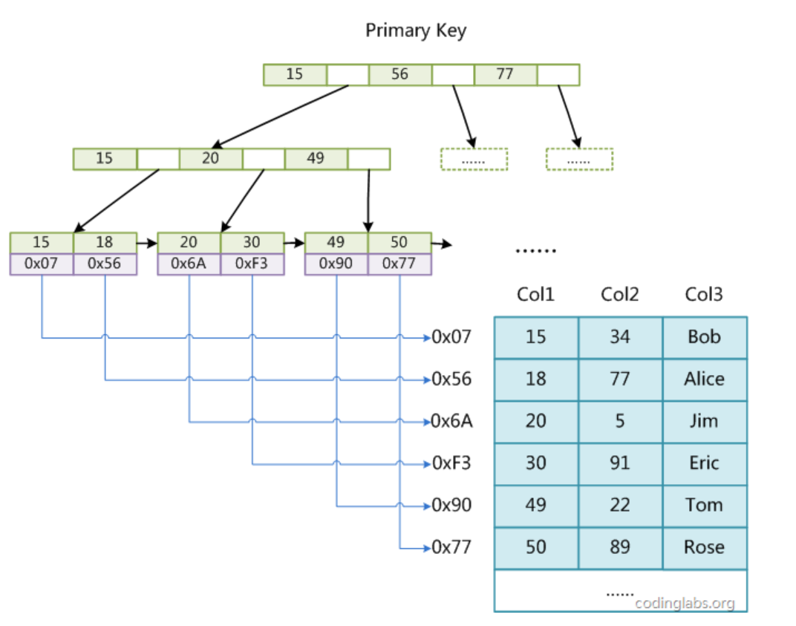
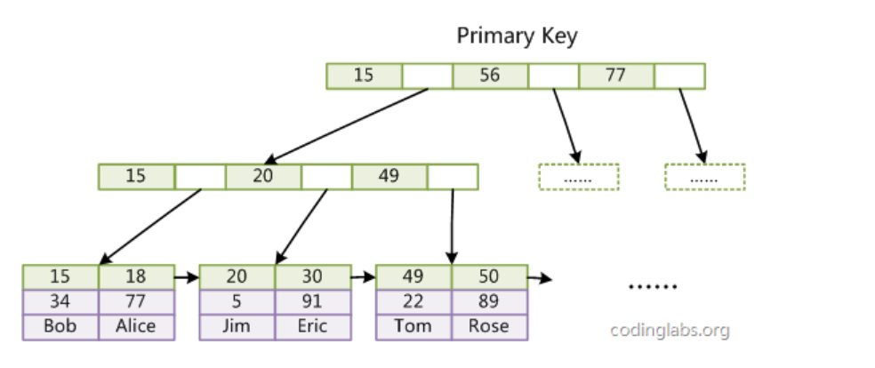
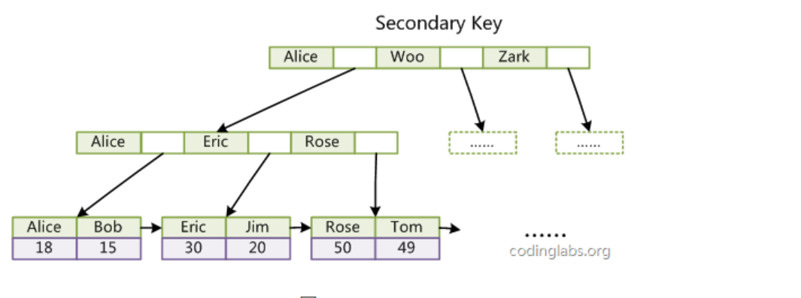
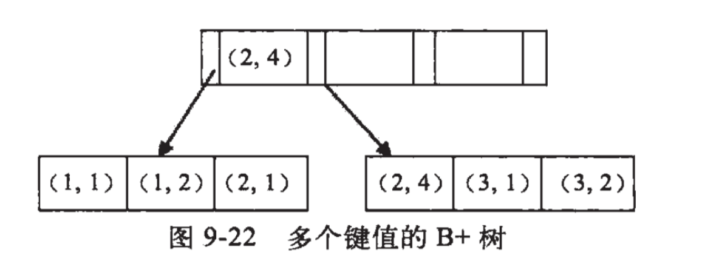

##### Q1: ACID

- 原子性（Atomicity）
  - 一个事务是一个不可分割的工作单位
  - 终止出错的事务，并撤销该事务进行的所有变更。

- 一致性（Consistency）
  - 事务执行前后满足某种状态

- 隔离性（Isolation）
  - 多个事务并发执行时候，事务内部与其他事务是隔离的，并发执行的各个事务之间不能互相干扰

- 持久性（Durability）
  - 事务一旦提交，它对数据库的改变就应该是永久性的

##### Q2: mysql引擎有哪些你用过哪些,有哪些区别(mysql八股文)

数据库引擎是用于存储、处理和保护数据的核心服务。利用数据库引擎可控制访问权限并快速处理事务，从而满足企业内大多数需要处理大量数据的应用程序的要求。最常用的是InnoDB和Mylsam。

- InnoDB

  - InnoDB是一个事务型的存储引擎，有行级锁定和外键约束。提供了对数据库ACID事务的支持，并且实现了SQL标准的四种隔离级别。
  - 支持事务。可以从灾难中恢复（通过bin-log日志等）。
  - 外键约束。只有他支持外键。支持自动增加列属性auto_increment。
  - 索引结构：
    - InnoDB是B+Treee索引结构。Innodb的索引文件本身就是数据文件，即B+Tree的数据域存储的就是实际的数据，这种索引就是聚集索引。这个索引的key就是数据表的主键，因此InnoDB表数据文件本身就是主索引。InnoDB的==辅助索引数据域==存储的也是相应记录主键的值而不是地址，所以当以辅助索引查找时，会先根据辅助索引找到主键，再根据主键索引找到实际的数据。所以Innodb不建议使用过长的主键，否则会使辅助索引变得过大。建议使用自增的字段作为主键，这样B+Tree的每一个结点都会被顺序的填满，而不会频繁的分裂调整，会有效的提升插入数据的效率。

- Mylsam

  - MyIASM是MySQL默认的引擎，但是它没有提供对数据库事务的支持，也不支持行级锁和外键，因此当INSERT或UPDATE数据时即写操作需要锁定整个表，效率便会低一些。MyIsam 存储引擎独立于操作系统，也就是可以在windows上使用，也可以比较简单的将数据转移到linux操作系统上去。
  - 查询速度很快，如果数据库insert和update的操作比较多的话比较适用。
  - MyISAM索引结构：MyISAM索引用的B+ tree来储存数据，MyISAM索引的指针指向的是键值的地址，地址存储的是数据。B+Tree的数据域存储的内容为实际数据的地址，也就是说它的索引和实际的数据是分开的，只不过是用索引指向了实际的数据，这种索引就是所谓的非聚集索引。

- InnoDB和Mylsam的区别：

  1）事务：MyISAM类型不支持事务处理等高级处理，而InnoDB类型支持，提供事务支持已经外部键等高级数据库功能。

   2）性能：MyISAM类型的表强调的是性能，其执行数度比InnoDB类型更快。

   3）行数保存：InnoDB 中不保存表的具体行数，也就是说，执行select count() fromtable时，InnoDB要扫描一遍整个表来计算有多少行，但是MyISAM只要简单的读出保存好的行数即可。注意的是，当count()语句包含where条件时，两种表的操作是一样的。

   4）索引存储：对于AUTO_INCREMENT类型的字段，InnoDB中必须包含只有该字段的索引，但是在MyISAM表中，可以和其他字段一起建立联合索引。MyISAM支持全文索引（FULLTEXT）、压缩索引，InnoDB不支持。

  MyISAM的索引和数据是分开的，并且索引是有压缩的，内存使用率就对应提高了不少。能加载更多索引，而Innodb是索引和数据是紧密捆绑的，没有使用压缩从而会造成Innodb比MyISAM体积庞大不小。

  InnoDB存储引擎被完全与MySQL服务器整合，InnoDB存储引擎为在主内存中缓存数据和索引而维持它自己的缓冲池。InnoDB存储它的表＆索引在一个表空间中，表空间可以包含数个文件（或原始磁盘分区）。这与MyISAM表不同，比如在MyISAM表中每个表被存在分离的文件中。InnoDB 表可以是任何尺寸，即使在文件尺寸被限制为2GB的操作系统上。

    5）服务器数据备份：InnoDB必须导出SQL来备份，LOAD TABLE FROM MASTER操作对InnoDB是不起作用的，解决方法是首先把InnoDB表改成MyISAM表，导入数据后再改成InnoDB表，但是对于使用的额外的InnoDB特性(例如外键)的表不适用。

  MyISAM应对错误编码导致的数据恢复速度快。MyISAM的数据是以文件的形式存储，所以在跨平台的数据转移中会很方便。在备份和恢复时可单独针对某个表进行操作。

  InnoDB是拷贝数据文件、备份 binlog，或者用 mysqldump，在数据量达到几十G的时候就相对痛苦了。

    6）锁的支持：MyISAM只支持表锁。InnoDB支持表锁、行锁 行锁大幅度提高了多用户并发操作的新能。但是InnoDB的行锁，只是在WHERE的主键是有效的，非主键的WHERE都会锁全表的。

- 在Mysql数据库中，常用的引擎为Innodb和MyIASM,其中Innodb是一个事务型的存储引擎，有行级锁定和外键约束，提供了对数据库ACID事物的支持，实现了SQL标准的四种隔离级别，即读未提交，不可重复读，可重复读以及串行,其涉及目标就是处理大数据容量的数据库系统。而MyIASM引擎是Mysql默认的引擎，不提供数据库事务的支持，也不支持行级锁和外键，因此当写操作时需要锁定整个表，效率较低。不过其保存了表的行数，当金星select count(*)form table时，可直接读取已经保存的值，不需要进行全表扫描。因此当表的读操作远多于写操作，并且不需要事务支持时，可以优先选择MyIASM

##### Q3: mysql视图

- 视图（子查询）：是从一个或多个表导出的虚拟的表，其内容由查询定义。具有普通表的结构，但是不实现数据存储。
- 创建视图
  - `CREATE OR REAPLACE VEIW [VIEW_NAME] AS [SELECT PHASE]`
- 查询视图
  - ``
- 删除视图
  - `DROP VIEW [VIEW_NAME]`
- 对视图的修改也会导致对表数据的修改
- 左查询[?]

#####  Q4: inner join, right join, left join区别

- left join(左联接) 返回包括左表中的所有记录和右表中联结字段相等的记录 
- right join(右联接) 返回包括右表中的所有记录和左表中联结字段相等的记录
- inner join(等值连接) 只返回两个表中联结字段相等的行

##### Q5:数据库的四个隔离级别

|事务隔离级别| 脏读 | 不可重复读  | 幻读|
| :--------:|-----|------------|------|
|读未提交内容 | 是 | 是 | 是|
|读提交内容| 否| 是| 是|
|可重复读| 否| 否| 是|
| 串行化|否| 否| 否|

- 脏读： 某个事务已更新一份数据，另一个事务在此时读取了同一份数据，由于某些原因，前一个RollBack了操作，则后一个事务所读取的数据就会是不正确的。
- 不可重复读： 在一个事务的两次查询之中数据不一致，这可能是两次查询过程中间插入了一个事务更新的原有的数据。
- 幻读： 在一个事务的两次查询中数据笔数不一致，例如有一个事务查询了几列(Row)数据，而另一个事务却在此时插入了新的几列数据，先前的事务在接下来的查询中，就会发现有几列数据是它先前所没有的。
- **不可重复读** 和 **幻读**区别
  - 不可重复读是读取了其他事务更改的数据，针对update操作
  - 幻读是读取了其他事务新增的数据，针对insert和delete操作
  - 不可重复读和脏读的区别是：脏读是某一事务读取了另一个事务未提交的脏数据，而不可重复读则是读取了前一事务提交的数据。
  - 幻读和不可重复读都是读取了另一条已经提交的事务（这点就脏读不同），所不同的是不可重复读查询的都是同一个数据项，而幻读针对的是一批数据整体（比如数据的个数）。

TODO : 隔离级别实验

##### Q6: MySQL 索引（索引组织结构以及如何建立索引）

- 数据库索引是为了增加查询速度而对表字段附加的一种标识，是对数据库表中一列或多列的值进行排序的一种结构。

- MySQL 索引实现
  - MyISAM : B+TREE, 叶结点的data域存放数据记录的地址

  

  - InnoDB 索引实现

   

  - InnoDB 本身的数据文件本身也是索引，
  - InnoDB 的辅助索引data域存储相应记录主键的值而不是地址。换句话说，InnoDB的所有辅助索引都引用主键作为data域

  

##### Q7: MySQL应该给哪些列建索引，哪些不应该建索引。

- 建立索引的原则
  - 既然索引可以加快查询速度，那么是不是只要是查询语句需要，就建上索引？答案是否定的。因为索引虽然加快了查询速度，但索引也是有代价的：索引文件本身要消耗存储空间，同时索引会加重插入、删除和修改记录时的负担，另外，MySQL在运行时也要消耗资源维护索引，因此索引并不是越多越好。一般两种情况下不建议建索引。

  - 第一种情况是表记录比较少，例如一两千条甚至只有几百条记录的表，没必要建索引，让查询做全表扫描就好了。至于多少条记录才算多，这个个人有个人的看法，我个人的经验是以2000作为分界线，记录数不超过 2000可以考虑不建索引，超过2000条可以酌情考虑索引。

  - 另一种不建议建索引的情况是索引的选择性较低。所谓索引的选择性（Selectivity），是指不重复的索引值（也叫基数，Cardinality）与表记录数（#T）的比值：

    Index Selectivity = Cardinality / #T

显然选择性的取值范围为(0, 1]，选择性越高的索引价值越大，这是由B+Tree的性质决定的。例如，上文用到的employees.titles表，如果title字段经常被单独查询，是否需要建索引，我们看一下它的选择性

##### Q8: 乐观锁和悲观锁
- 悲观锁：总是假设最坏的情况，每次去拿数据的时候都认为别人会修改，所以每次在拿数据的时候都会上锁，这样别人想拿这个数据就会阻塞直到它拿到锁（共享资源每次只给一个线程使用，其它线程阻塞，用完后再把资源转让给其它线程）。
- 乐观锁：总是假设最好的情况，每次去拿数据的时候都认为别人不会修改，所以不会上锁，但是在更新的时候会判断一下在此期间别人有没有去更新这个数据，可以使用版本号机制和CAS算法实现。乐观锁适用于多读的应用类型，这样可以提高吞吐量

- 从上面对两种锁的介绍，我们知道两种锁各有优缺点，不可认为一种好于另一种，像*乐观锁适用于写比较少的情况下（多读场景），即冲突真的很少发生的时候，这样可以省去了锁的开销，加大了系统的整个吞吐量*。但如果是多写的情况，一般会经常产生冲突，这就会导致上层应用会不断的进行retry，这样反倒是降低了性能，所以一般多写的场景下用悲观锁就比较合适。

- 乐观锁实现
  - 版本号机制
  - CAS算法

##### Q9: Having与Where的区别
- where 子句的作用是在对查询结果进行分组前，将不符合where条件的行去掉，即在分组之前过滤数据。where条件中不能包含聚合函数，可以使用where条件过滤出特定的行。

- Having字句与where子句一样可以进行条件判断的，另外Having 子句通常用来筛选满足条件的组，即在分组之后过滤数据。条件中经常包含聚合函数，使用having 条件过滤出特定的组，也可以使用多个分组标准进行分组。

- 通常使用group by+having的时候会使用聚合函数，因为分组之后的列要么是聚合函数，要么是group by( 列)中的列。

- on是在生成临时表的时候使用的条件，不管on的条件是否起到作用，都会返回左表 (table_name1) 的行。
- where则是在生成临时表之后使用的条件，此时已经不管是否使用了left join了，只要条件不为真的行，全部过滤掉

##### Q10: 最左匹配原则
- 最左优先，以最左边的为起点任何连续的索引都能匹配上。
- 针对的是联合索引

EXPLAIN
事务和锁
前缀索引
聚簇索引
索引覆盖
索引什么时候失效
MVCC
死锁
查询优化
主从复制
读写分离