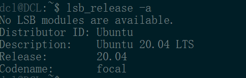
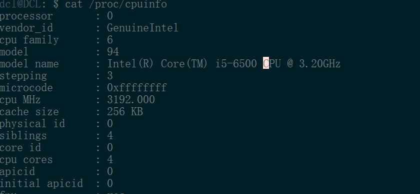
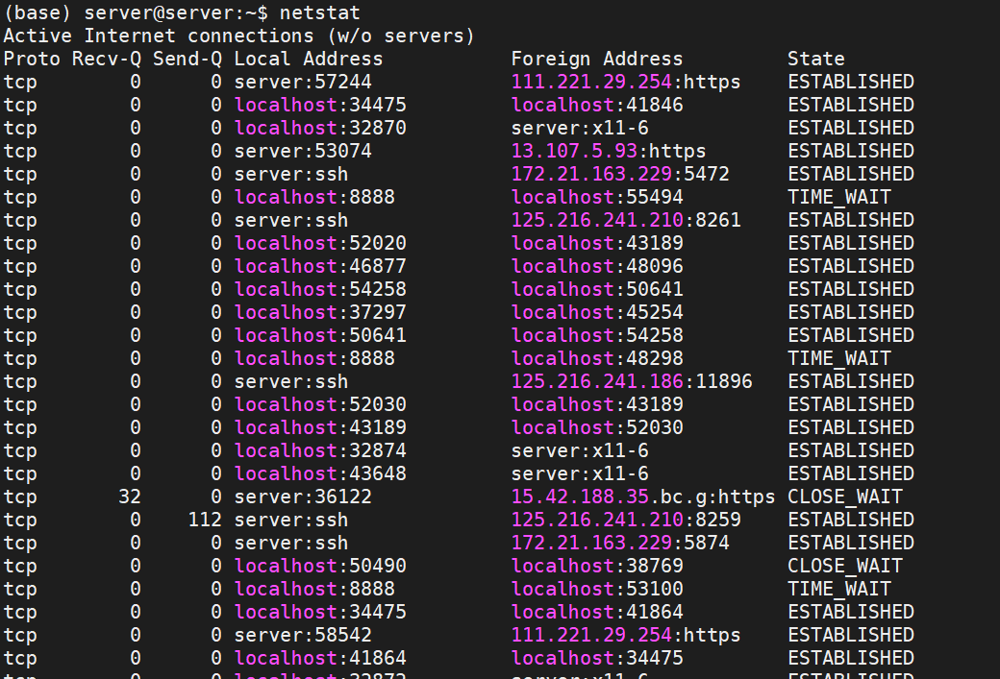
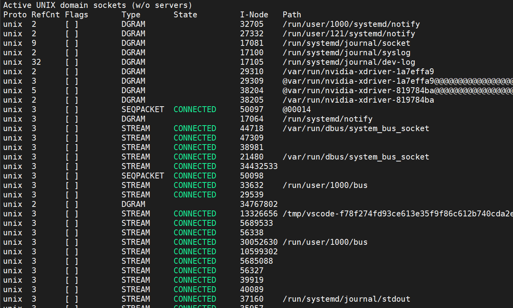

## Q1 怎么查看计算机状态，内存等使用情况
- 操作系统版本
  - `lsb_release -a`
  - 
- CPU信息
  - `cat /proc/cpuinfo`
  - 
- `top`命令： top命令是Linux下常用的性能分析工具，能够实时显示系统中各个进程的资源占用状况，类似于Windows的任务管理器。显示当前系统正在执行的进程的相关信息，包括进程ID、内存占用率、CPU占用率等

    ```bash
    top - 09:59:33 up 5 min,  0 users,  load average: 0.52, 0.58, 0.59
    Tasks:   4 total,   1 running,   3 sleeping,   0 stopped,   0 zombie
    %Cpu(s):  8.7 us,  6.8 sy,  0.0 ni, 84.0 id,  0.0 wa,  0.5 hi,  0.0 si,  0.0 st
    MiB Mem :  16331.9 total,   8162.2 free,   7945.7 used,    224.0 buff/cache
    MiB Swap:  38400.1 total,  38278.0 free,    122.1 used.   8255.6 avail Mem

    PID USER      PR  NI    VIRT    RES    SHR S  %CPU  %MEM     TIME+ COMMAND
        1 root      20   0    8892    308    272 S   0.0   0.0   0:00.18 init
        9 root      20   0    8908    224    168 S   0.0   0.0   0:00.01 init
    10 dcl       20   0   18096   3776   3676 S   0.0   0.0   0:00.38 bash
    80 dcl       20   0   18904   2132   1520 R   0.0   0.0   0:00.04 top
    ```
    - 第一行中`09:59:33 up 5 min,  0 users,  load average: 0.52, 0.58, 0.59`， 
        - `09:59:33`当前系统运行时间
        - ` up 5 min`:系统运行的时间
        - `0 users`:当前有个用户登录系统
        - `load average: 0.52, 0.58, 0.59`:load average后面的三个数分别是1分钟、5分钟、15分钟的负载情况
        - load average数据是每隔5秒钟检查一次活跃的进程数，然后按特定算法计算出的数值。如果这个数除以逻辑CPU的数量，结果高于5的时候就表明系统在超负荷运转了。
    - 第二行中`Tasks:   4 total,   1 running,   3 sleeping,   0 stopped,   0 zombie`:系统现在共有4个进程，其中处于运行中的有1个，3个在休眠（sleep），stoped状态的有0个，zombie状态（僵尸）的有0个
    - 第三行中`%Cpu(s):  8.7 us,  6.8 sy,  0.0 ni, 84.0 id,  0.0 wa,  0.5 hi,  0.0 si,  0.0 st`: `Cpu`属性
        - `8.7 us` : 用户空间占用CPU的百分比。
        - `6.8 sy`: 内核空间占用CPU的百分比。
        - `0.0 ni`:改变过优先级的进程占用CPU的百分比
        - `84.0 id`: 空闲CPU百分比
        - `0.0% wa` — IO等待占用CPU的百分比
        - `0.5 hi`- 硬中断（Hardware IRQ）占用CPU的百分比
        - `0.0` - 软中断（Software Interrupts）占用CPU的百分比
    - 第四行中`MiB Mem :  16331.9 total,   8162.2 free,   7945.7 used,    224.0 buff/cache`: 内存信息
        - `16331.9 total`: 物理内存
        - `7945.7 used`:使用中的内存
        - `8162.2 free`:未使用的内存
        - `224.0 buff/cache`: 缓存的内存量
    - 第五行中`MiB Swap:  38400.1 total,  38278.0 free,    122.1 used.   8255.6 avail Mem`：swap交换分区信息，具体信息说明如下：
        - `38400.1 total`：交换区总量
        - `38278.0 free`:空闲交换区总量
        - `122.1 used`— 使用的交换区总量
    - 第七行以下：各进程（任务）的状态监控，项目列信息说明
        - PID — 进程id
        - USER — 进程所有者
        - PR — 进程优先级
        - NI — nice值。负值表示高优先级，正值表示低优先级
        - VIRT — 进程使用的虚拟内存总量，单位kb。VIRT=SWAP+RES
        - RES — 进程使用的、未被换出的物理内存大小，单位kb。RES=CODE+DATA
        - SHR — 共享内存大小，单位kb
        - S — 进程状态。D=不可中断的睡眠状态 R=运行 S=睡眠 T=跟踪/停止 Z=僵尸进程
        - %CPU — 上次更新到现在的CPU时间占用百分比
        - %MEM — 进程使用的物理内存百分比
        - TIME+ — 进程使用的CPU时间总计，单位1/100秒
        - COMMAND — 进程名称（命令名/命令行）

- `free`命令
  - free 命令显示系统使用和空闲的内存情况，包括物理内存、交互区内存(swap)和内核缓冲区内存。共享内存将被忽略

```bash
dcl@DCL:~$ free
              total        used        free      shared  buff/cache   available
Mem:       16723852     7875024     8619476       17720      229352     8715096
Swap:      39321724      139784    39181940
```


- `fdisk`: Linux fdisk是一个创建和维护分区表的程序，它兼容DOS类型的分区表、BSD或者SUN类型的磁盘列表。
- `df`: Linux df命令用于显示目前在Linux系统上的文件系统的磁盘使用情况统计。


## Q2: 网络相关的命令
- `netstat`





  - 从整体上看，netstat的输出结果可以分为两个部分：
      - 一个是Active Internet connections，称为有源TCP连接，其中"Recv-Q"和"Send-Q"指%0A的是接收队列和发送队列。这些数字一般都应该是0。如果不是则表示软件包正在队列中堆积。这种情况只能在非常少的情况见到。
      - 另一个是Active UNIX domain sockets，称为有源Unix域套接口(和网络套接字一样，但是只能用于本机通信，性能可以提高一倍)。Proto显示连接使用的协议,RefCnt表示连接到本套接口上的进程号,Types显示套接口的类型,State显示套接口当前的状态,Path表示连接到套接口的其它进程使用的路径名。
  - -a (all)显示所有选项，默认不显示LISTEN相关
  - -t (tcp)仅显示tcp相关选项
  - -u (udp)仅显示udp相关选项
  - -n 拒绝显示别名，能显示数字的全部转化成数字。
  - -l 仅列出有在 Listen (监听) 的服務状态

- `tcpdum`: dump the traffic on a network，根据使用者的定义对网络上的数据包进行截获的包分析工具。 tcpdump可以将网络中传送的数据包的“头”完全截获下来提供分析。它支持针对网络层、协议、主机、网络或端口的过滤，并提供and、or、not等逻辑语句来帮助你去掉无用的信息。

- `ipcs`是Linux下显示进程间通信设施状态的工具。可以显示消息队列、共享内存和信号量的信息。对于程序员非常有用，普通的系统管理员一般用不到此指令。
    - $ipcs -m 查看系统使用的IPC共享内存资源
    - $ipcs -q 查看系统使用的IPC队列资源
    - $ipcs -s 查看系统使用的IPC信号量资源

- `ipcrm`命令用来删除一个或更多的消息队列、信号量集或者共享内存标识。


## Q3: AWK命令


## Q4: frok和vfork的区别
- fork和vfork都用于创建子进程。但是vfork创建子进程后，父进程阻塞，直到子进程调用exit()或者excle()。
对于内核中过程fork通过调用clone函数，然后clone函数调用do_fork()。do_fork()中调用copy_process()函数先复制task_struct结构体，然后复制其他关于内存，文件，寄存器等信息。fork采用写时拷贝技术，因此子进程和父进程的页表指向相同的页框。但是vfork不需要拷贝页表，因为父进程会一直阻塞，直接使用父进程页表


## Q5: exit() 与 _exit()的区别
exit()清理后进入内核，_exit()直接陷入内核。

## Q6: 查linux下所有a开头文件行数

- wc -l `find ./ -name "openmesh*"`

## Q7: linux下查端口是否被用

- lsof -i:端口号查看某个端口是否被占用 
- netstat | grep 'port-number'

## Q7: Linux共享库、静态库、动态库详解

1、静态函数库，是在程序执行前就加入到目标程序中去了 ；
  - 静态库函数允许程序员把程序link起来而不用重新编译代码，节省了重新编译代码的时间。
  
2、动态函数库同共享函数库是一个东西（在linux上叫共享对象库， 文件后缀是.so ，windows上叫动态加载函数库， 文件后缀是.dll）
  - 共享函数库中的函数是在当一个可执行程序在启动的时候被加载。如果一个共享函数库正常安装，所有的程序在重新运行的时候都可以自动加载最新的函数库中的函数。对于Linux系统还有更多可以实现的功能： 
      - 升级了函数库但是仍然允许程序使用老版本的函数库。
      - 当执行某个特定程序的时候可以覆盖某个特定的库或者库中指定的函数。
      - 可以在库函数被使用的过程中修改这些函数库


## Q8: linux read想读50个字节，读到20就返回了
以下几种情况会导致读取到的字节数小于 nbytes ：
A. 读取普通文件时，读到文件末尾还不够 nbytes 字节。例如：如果文件只有 30 字节，而我们想读取 100 字节，那么实际读到的只有 30 字节，read 函数返回 30 。此时再使用 read 函数作用于这个文件会导致 read 返回 0 。
B. 从终端设备（terminal device）读取时，一般情况下每次只能读取一行
C. 从网络读取时，网络缓存可能导致读取的字节数小于 nbytes 字节。
D. 读取 pipe 或者 FIFO 时，pipe 或 FIFO 里的字节数可能小于 nbytes 。
E. 从面向记录（record-oriented）的设备读取时，某些面向记录的设备（如磁带）每次最多只能返回一个记录。
F. 在读取了部分数据时被信号中断。


## Q9: Linux 下各个目录的作用
[LINK](https://www.cnblogs.com/amboyna/archive/2008/02/16/1070474.html)

## Q10: 栈的指定大小为多少, 可不可以自行调节. 如何自行调节? 
一般，在Unix-like平台，栈的大小不是由程序自己来控制的而是由环境变量来控制的，所以就不能通过设置编译器（像gcc)的任何编译标志来设置栈的大小；在windows平台下，栈的大小的信息是包含在可执行文件中的。它可以在Visual C++的编译过程中设置，但是在gcc中是不可行的。也可以用Microsoft提供的一个叫作：”editbin.exe“程序来直接修改可执行文件的栈的大小。


## Q11: 怎么找到文本中的几行 
1. 根据关键字查看日志：`cat catlina.log | grep "test"`
2. 根据关键字查看后20行：`cat catlina.log | grep "test" -A 20`
3. 根据关键字查看前20行：`cat catlina.log | grep "test" -B 20`
4. 根据关键字查看前后20行：`cat -n catlina.log | grep "test" -C 20`
5. 查看日志前100行：`cat catlina.log | head -n 100`
6. 查看日志后100行：`cat -n catlina.log | tail -n 100`


Linux系统：
     ulimit -a    #显示当前用户的栈大小
     ulimit -s 32768 #将当前用户的栈大小设置为32M bytes

杀指定进程代码
linux按下ctrl+c为什么会结束当前进程(不会)

linux文件操作相关命令
