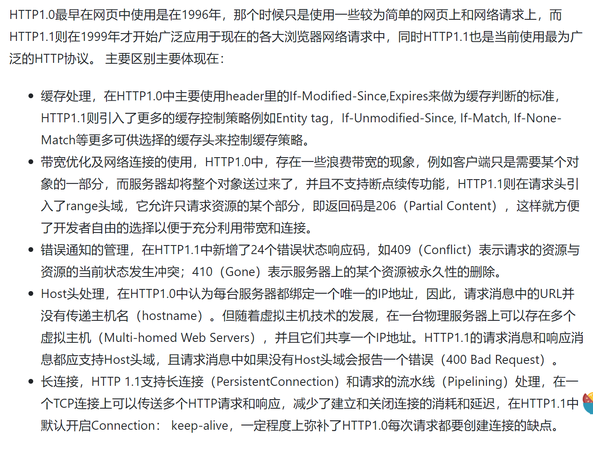

# Network

## Q1: OSI 和 TCP/IP 哪几层？每一层的作用？ 默认端口是什么


- OSI
  - 物理层
  - 数据链路层
  - 传输层
  - 网络层
  - 会话层
  - 表示层
  - 应用层
- TCP/IP
  - 物理层
  - 网络接口层
  - 网络层
    - ARP:地址解析协议；RARP
  - 传输层
  - 应用层

## Q2: TCP和UDP区别

- TCP面向连接的协议，收发数据之前要建立连接；UDP是一个非连接的协议，传输数据之前两端不用建立连接；
- TCP是可靠交付：无差错，不丢失，不重复，按序到达。UDP是尽最大努力交付，不保证可靠交付。
- TCP具有高可靠性，用==拥塞控制流量控制确保传输数据的正确性==；UDP在传输过程前不建立连接，不对数据报进行检查和修改；
- TCP对系统资源要求比较多；UDP对系统资源要求较少；
- UDP具有较好的实时性；工作效率比TCP高
- TCP是动态报文长度，即TCP报文长度是根据接收方的窗口大小和当前网络拥塞情况决定的。UDP面向报文，不合并，不拆分，保留上面传下来报文的边界。
- TCP首部开销大，首部20个字节。UDP首部开销小，8字节。（源端口，目的端口，数据长度，校验和）

## Q3: UDP相关

- UDP优化

## Q4: TCP相关

- 三次握手
  - A->B 发出请求连接数据包
    - Client将标志位SYN置为1，随机产生一个值seq=x，并将该数据包发送给Server，Client进入SYN_SENT状态，等待Server确认。
  - B->A 发出发送同意连接和要求同步
    - Server收到数据包后由标志位SYN=1知道Client请求建立连接，Server将标志位SYN和ACK都置为1，ack=x+1，随机产生一个值seq=y，并将该数据包发送给Client以确认连接请求，Server进入SYN_RCVD状态。
  - A->B 发送一个数据报确认主机B要求同步
    - Client收到确认后，检查ack是否为x+1，ACK是否为1，如果正确则将标志位ACK置为1，ack=y+1，并将该数据包发送给Server，Server检查ack是否为K+1，ACK是否为1，如果正确则连接建立成功，Client和Server进入ESTABLISHED状态，完成三次握手，随后Client与Server之间可以开始传输数据了。
- 四次握手
  - A->B 提出停止TCP连接请求
    - 数据传输结束后，客户端的应用进程发出连接释放报文段，并停止发送数据，客户端进入FIN_WAIT_1状态，此时客户端依然可以接收服务器发送来的数据。
  - B->A 确认TCP即将关闭
    - .服务器接收到FIN后，发送一个ACK给客户端，确认序号为收到的序号+1，服务器进入CLOSE_WAIT状态。客户端收到后进入FIN_WAIT_2状态。
  - B->A 提出关闭请求
    - 当服务器没有数据要发送时，服务器发送一个FIN报文，此时服务器进入LAST_ACK状态，等待客户端的确认
  - A->B 对请求进行确认呢
    - 客户端收到服务器的FIN报文后，给服务器发送一个ACK报文，确认序列号为收到的序号+1。此时客户端进入TIME_WAIT状态，等待2MSL（MSL：报文段最大生存时间），然后关闭连接。


- TIME_WAIT和CLOSE_WAIT
  - 详细过程
    - 主动关闭连接的一方，调用close()；协议层发送FIN包 ;
    - 被动关闭的一方收到FIN包后，协议层回复ACK；然后被动关闭的一方，进入==CLOSE_WAIT==状态，主动关闭的一方等待对方关闭，则进 入==FIN_WAIT_2==状态；此时，主动关闭的一方等待被动关闭一方的应用程序，调用close操作 ;
    - 被动关闭的一方在完成所有数据发送后，调用close()操作；此时，协议层发送FIN包给主动关闭的一方，等待对方的ACK，被动关闭的一方进入==LAST_ACK==状态；
    - 主动关闭的一方收到FIN包，协议层回复ACK；此时，主动关闭连接的一方，进入==TIME_WAIT==状态；而被动关闭的一方，进入CLOSED状态 ;
    - 等待2MSL时间，主动关闭的一方，结束TIME_WAIT，进入CLOSED状态 ; 
  - TIME_WAIT
    - TIME_WAIT 是主动关闭链接时形成的，等待2MSL时间，约4分钟。主要是防止最后一个ACK丢失。  由于TIME_WAIT 的时间会非常长，因此server端应尽量减少主动关闭连接
    - 假设最终的ACK丢失，server将重发FIN，client必须维护TCP状态信息以便可以重发最终的ACK，否则会发送RST，结果server认为发生错误。TCP实现必须可靠地终止连接的两个方向(全双工关闭)，client必须进入 TIME_WAIT 状态，因为client可能面 临重发最终ACK的情形。
    - 如果 TIME_WAIT 状态保持时间不足够长(比如小于2MSL)，第一个连接就正常终止了。第二个拥有相同相关五元组的连接出现，而第一个连接的重复报文到达，干扰了第二个连接。TCP实现必须防止某个连接的重复报文在连接终止后出现，所以让TIME_WAIT状态保持时间足够长(2MSL)，连接相应方向上的TCP报文要么完全响应完毕，要么被 丢弃。建立第二个连接的时候，不会混淆。
  - CLOSE_WAIT
    - CLOSE_WAIT是被动关闭连接是形成的。根据TCP状态机，服务器端收到客户端发送的FIN，则按照TCP实现发送ACK，因此进入CLOSE_WAIT状态。但如果服务器端不执行close()，就不能由CLOSE_WAIT迁移到LAST_ACK，则系统中会存在很多CLOSE_WAIT状态的连接。此时，可能是系统忙于处理读、写操作，而未将已收到FIN的连接，进行close。此时，recv/read已收到FIN的连接socket，会返回0。

- 大量TIME_WAIT解决方案
  - 应用层面
　  - 尽量避免频繁关闭连接，如业务优化，或者使用长连接等；
  - 系统层面
    - 缩短MSL时间。
    - 增加可用端口数量。可用端口数量=单进程可打开的连接数量*机器数量。
  - MSL时间
　　RFC793定义MSL为2分钟。
    ```c++
    查看：sysctl -a | grep time | grep wait
    修改：

    vi /etc/sysctl.conf;
    net.ipv4.tcp_fin_timeout = 30;
    执行 /sbin/sysctl -p 让参数生效;
    ```
  - TIME_WAIT的重用和快速回收
    - 打开方式：设置TCP参数` net.ipv4.tcp_tw_reuse = 1` 和` net.ipv4.tcp_tw_recycle = 1；`注意：使用tcp_tw_reuse和tcp_tw_recycle解决TIME_WAIT过多问题是非常危险的，参考RFC
- CLOSE_WAIT

## Q5: 点击一个网址会发生什么？

- 首先将域名解析为IP（使用DNS协议）
- 建立连接（三次握手）
- 传输数据
- 断开连接（四次挥手）

## Q6: DNS协议

- 过程： 


    ①本机向local dns请求www.baidu.com
    
    ②local dns向根域请求www.baidu.com，根域返回com.域的服务器IP
    
    ③向com.域请求www.baidu.com，com.域返回baidu.com域的服务器IP
    
    ④向baidu.com请求www.baidu.com，返回cname www.a.shifen.com和a.shifen.com域的服务器IP
    
    ⑤向root域请求www.a.shifen.com
    
    ⑥向com.域请求www.a.shife.com
    
    ⑦向shifen.com请求
    
    ⑧向a.shifen.com域请求
    
    ⑨拿到www.a.shifen.com的IP
    
    ⑩localdns返回本机www.baidu.com cname www.a.shifen.com 以及 www.a.shifen.com的IP


​    
​    
## Q7: https和http区别

- HTTP协议是以明文的方式在网络中传输数据，而HTTPS协议传输的数据则是经过TLS加密后的，HTTPS具有更高的安全性

- HTTPS在TCP三次握手阶段之后，还需要进行SSL 的handshake，协商加密使用的对称加密密钥

- HTTPS协议需要服务端申请证书，浏览器端安装对应的根证书

- HTTP协议端口是80，HTTPS协议端口是443

- HTTPS优点：

  - HTTPS传输数据过程中使用密钥进行加密，所以安全性更高
  - HTTPS协议可以认证用户和服务器，确保数据发送到正确的用户和服务器

- HTTPS缺点：

  - HTTPS握手阶段延时较高：由于在进行HTTP会话之前还需要进行SSL握手，因此HTTPS协议握手阶段延时增加

  - HTTPS部署成本高：一方面HTTPS协议需要使用证书来验证自身的安全性，所以需要购买CA证书；另一方面由于采用HTTPS协议需要进行加解密的计算，占用CPU资源较多，需要的服务器配置或数目高


## Q8: http1.0和http1.1最大的区别?==长连接除了能够节省频繁握手挥手的开销还有什么优点?==

<!--  -->
- 缓存处理，在HTTP1.0中主要使用header里的If-Modified-Since,Expires来做为缓存判断的标准，HTTP1.1则引入了更多的缓存控制策略例如Entity tag，If-Unmodified-Since, If-Match, If-None-Match等更多可供选择的缓存头来控制缓存策略。

- 带宽优化及网络连接的使用，HTTP1.0中，存在一些浪费带宽的现象，例如客户端只是需要某个对象的一部分，而服务器却将整个对象送过来了，并且不支持断点续传功能，HTTP1.1则在请求头引入了range头域，它允许只请求资源的某个部分，即返回码是206（Partial Content），这样就方便了开发者自由的选择以便于充分利用带宽和连接。

- 错误通知的管理，在HTTP1.1中新增了24个错误状态响应码，如409（Conflict）表示请求的资源与资源的当前状态发生冲突；410（Gone）表示服务器上的某个资源被永久性的删除。

- Host头处理，在HTTP1.0中认为每台服务器都绑定一个唯一的IP地址，因此，请求消息中的URL并没有传递主机名（hostname）。但随着虚拟主机技术的发展，在一台物理服务器上可以存在多个虚拟主机（Multi-homed Web Servers），并且它们共享一个IP地址。HTTP1.1的请求消息和响应消息都应支持Host头域，且请求消息中如果没有Host头域会报告一个错误（400 Bad Request）。

- 长连接，HTTP 1.1支持长连接（PersistentConnection）和请求的流水线（Pipelining）处理，在一个TCP连接上可以传送多个HTTP请求和响应，减少了建立和关闭连接的消耗和延迟，在HTTP1.1中默认开启Connection： keep-alive，一定程度上弥补了HTTP1.0每次请求都要创建连接的缺点。


## Q9: HTTP 和 HTTPs区别？

HTTPS和HTTP的区别主要如下：

1、https协议需要到ca申请证书，一般免费证书较少，因而需要一定费用。

2、http是超文本传输协议，信息是明文传输，https则是具有安全性的ssl加密传输协议。

3、http和https使用的是完全不同的连接方式，用的端口也不一样，前者是80，后者是443。

4、http的连接很简单，是无状态的；HTTPS协议是由SSL+HTTP协议构建的可进行加密传输、身份认证的网络协议，比http协议安全。

## Q10: TCP拥塞控制

拥塞控制是防止过多的数据注入网络，使得网络中的路由器或者链路过载。流量控制是点对点的通信量控制，而拥塞控制是全局的网络流量整体性的控制。发送双方都有一个拥塞窗口——cwnd。

1、慢开始

最开始发送方的拥塞窗口为1，由小到大逐渐增大发送窗口和拥塞窗口。每经过一个传输轮次，拥塞窗口cwnd加倍。当cwnd超过慢开始门限，则使用拥塞避免算法，避免cwnd增长过大。

2、拥塞避免

每经过一个往返时间RTT，cwnd就增长1。

在慢开始和拥塞避免的过程中，一旦发现网络拥塞，就把慢开始门限设为当前值的一半，并且重新设置cwnd为1，重新慢启动。（乘法减小，加法增大）

3、快重传

接收方每次收到一个失序的报文段后就立即发出重复确认，发送方只要连续收到三个重复确认就立即重传（尽早重传未被确认的报文段）。

4、快恢复

当发送方连续收到了三个重复确认，就乘法减半（慢开始门限减半），将当前的cwnd设置为慢开始门限，并且采用拥塞避免算法（连续收到了三个重复请求，说明当前网络可能没有拥塞）。

采用慢开始和拥塞避免算法的时候

1. 一旦cwnd>慢开始门限，就采用拥塞避免算法，减慢增长速度

2. 一旦出现丢包的情况，就重新进行慢开始，减慢增长速度

采用快恢复和快重传算法的时候

1. 一旦cwnd>慢开始门限，就采用拥塞避免算法，减慢增长速度

2. 一旦发送方连续收到了三个重复确认，就采用拥塞避免算法，减慢增长速度


## Q11: 请问tcp握手为什么两次不可以？为什么不用四次？

两次不可以：tcp是全双工通信，两次握手只能确定单向数据链路是可以通信的，并不能保证反向的通信正常
不用四次：
本来握手应该和挥手一样都是需要确认两个方向都能联通的，本来模型应该是：
1.客户端发送syn0给服务器
2.服务器收到syn0，回复ack(syn0+1)
3.服务器发送syn1
4.客户端收到syn1，回复ack(syn1+1)
因为tcp是全双工的，上边的四部确认了数据在两个方向上都是可以正确到达的，但是2，3步没有没有上下的联系，可以将其合并，加快握手效率，所有就变成了3步握手。

## Q12: 路由协议有哪些？

## Q13: accept连接队列满了怎么办？直接发rst有问题吗？有什么好的解决方法？
- 什么是 TCP 半连接队列和全连接队列？
  - 在 TCP 三次握手的时候，Linux 内核会维护两个队列，分别是：
    - 半连接队列，也称 SYN 队列；
    - 全连接队列，也称 accepet 队列
  - 服务端收到客户端发起的 SYN 请求后，内核会把该连接存储到半连接队列，并向客户端响应 SYN+ACK，接着客户端会返回 ACK，服务端收到第三次握手的 ACK 后，内核会把连接从半连接队列移除，然后创建新的完全的连接，并将其添加到 accept 队列，等待进程调用 accept 函数时把连接取出来。
- 如何知道应用程序的 TCP 全连接队列大小？
  - `ss`命令
- 全连接队列溢出
  - Linux 有个参数可以指定当 TCP 全连接队列满了会使用什么策略来回应客户端。
  - 实际上，丢弃连接只是 Linux 的默认行为，我们还可以选择向客户端发送 RST 复位报文，告诉客户端连接已经建立失败。
  -  TCP 全连接队列满导致服务器丢掉了 ACK，与此同时，客户端的连接状态却是 ESTABLISHED，进程就在建立好的连接上发送请求。只要服务器没有为请求回复 ACK，请求就会被多次重发。如果服务器上的进程只是短暂的繁忙造成 accept 队列满，那么当 TCP 全连接队列有空位时，再次接收到的请求报文由于含有 ACK，仍然会触发服务器端成功建立连接。
  -  TCP 全连接队列的最大值取决于 somaxconn 和 backlog 之间的最小值，也就是 min(somaxconn, backlog)。


## Q14: HTTP 状态码; HTTP协议
- 状态码：
  - 200 - 请求成功
  - 301 - 资源（网页等）被永久转移到其它URL
  - 404 - 请求的资源（网页等）不存在
  - 500 - 内部服务器错误

## Q15: http1.1怎样保证一次请求结束

## Q16:tcp可靠性（没背）
- 校验和
  - 计算方式：在数据传输的过程中，将发送的数据段都当做一个16位的整数。将这些整数加起来。并且前面的进位不能丢弃，补在后面，最后取反，得到校验和
  - 注意：如果接收方比对校验和与发送方不一致，那么数据一定传输有误。但是如果接收方比对校验和与发送方一致，数据不一定传输成功。

- 确认应答与序列号
  - 序列号：TCP传输时将每个字节的数据都进行了编号，这就是序列号。
  - TCP传输的过程中，每次接收方收到数据后，都会对传输方进行确认应答。也就是发送ACK报文。这个ACK报文当中带有对应的确认序列号，告诉发送方，接收到了哪些数据，下一次的数据从哪里发。
  - 序列号的作用不仅仅是应答的作用，有了序列号能够将接收到的数据根据序列号排序，并且去掉重复序列号的数据。这也是TCP传输可靠性的保证之一。

- 超时重传
  - 是发送方在发送完数据后等待一个时间，时间到达没有接收到ACK报文，那么对刚才发送的数据进行重新发送。
- 连接管理
  - 三次握手与四次挥手的过程
- 流量控制
  - 窗口大小的内容实际上是接收端接收数据缓冲区的剩余大小。这个数字越大，证明接收端接收缓冲区的剩余空间越大，网络的吞吐量越大。接收端会在确认应答发送ACK报文时，将自己的即时窗口大小填入，并跟随ACK报文一起发送过去。而发送方根据ACK报文里的窗口大小的值的改变进而改变自己的发送速度。如果接收到窗口大小的值为0，那么发送方将停止发送数据。并定期的向接收端发送窗口探测数据段，让接收端把窗口大小告诉发送端。
- 拥塞控制
## Q17: TCP是基于字节流的，数据可以怎样区分


## Q18: http协议get和post请求

## Q19: 长短连接
- 如何理解HTTP协议是无状态的
  - HTTP协议是无状态的，指的是协议对于事务处理没有记忆能力，服务器不知道客户端是什么状态。也就是说，打开一个服务器上的网页和你之前打开这个服务器上的网页之间没有任何联系。HTTP是一个无状态的面向连接的协议，无状态不代表HTTP不能保持TCP连接，更不能代表HTTP使用的是UDP协议（无连接）
- 在HTTP/1.0中，默认使用的是短连接。也就是说，浏览器和服务器每进行一次HTTP操作，就建立一次连接，但任务结束就中断连接。如果客户端浏览器访问的某个HTML或其他类型的 Web页中包含有其他的Web资源，如JavaScript文件、图像文件、CSS文件等；当浏览器每遇到这样一个Web资源，就会建立一个HTTP会话。
- 但从 HTTP/1.1起，默认使用长连接，用以保持连接特性。使用长连接的HTTP协议，会在响应头有加入这行代码：`Connection:keep-alive`，　　在使用长连接的情况下，当一个网页打开完成后，客户端和服务器之间用于传输HTTP数据的 TCP连接不会关闭，如果客户端再次访问这个服务器上的网页，会继续使用这一条已经建立的连接。Keep-Alive不会永久保持连接，它有一个保持时间，可以在不同的服务器软件（如Apache）中设定这个时间。实现长连接要客户端和服务端都支持长连接。


## Q20: https为什么比http安全
- HTTP协议传输的数据都是未加密的。
## Q21: DNS解析过程

## Q22: 流量劫持? tcp/udp/http哪个容易被流量劫持
- 流量劫持就是在这些环节当中，对数据进行偷窃、篡改，甚至转发流量进行攻击的这样一类行为。从危害上来说，互联网上最可怕的攻击也莫过于此了。
- HTTP：

1，HTTP不能防DNS劫持，劫持者可以把域名解析指向别的服务器IP。

2，HTTP不能防流量劫持，内容是不加密的，劫持者可以把源站返回的内容加料，比如加些小广告。

 

HTTPS：

1，HTTPS并不能防DNS劫持域名解析，假设劫持者劫持了域名解析，浏览器由于证书校验不通过，假站点返回的内容也不能正常展示，所以劫持没有收益。只要不随意信任来源不明的证书，就能从功能上防DNS劫持。

2，HTTPS可以防流量劫持，因为内容是加密的。


## Q23: HTTP报文头
-  HTTP协议的请求和响应报文中必定包含HTTP首部，首部内容为客户端和服务器分别处理请求和响应提供所需要的信息。 


## Q24: HTTPs加密过程

- 具体的交互过程如下：
  - 证书验证阶段
      - 浏览器发起 HTTPS 请求
      - 服务端返回 HTTPS 证书
      - 客户端验证证书是否合法，如果不合法则提示告警
② 数据传输阶段

1.当证书验证合法后，在本地生成随机数

2.通过公钥加密随机数，并把加密后的随机数传输到服务端

3.服务端通过私钥对随机数进行解密

4.服务端通过客户端传入的随机数构造对称加密算法，对返回结果内容进行加密后传输

## Q25: TCP 如何实现纠错
TCP协议支持数据报传输可靠性的主要方法是确认、超时、重传、校验和以及流量控制。

（1）校验和——每个TCP报文段都包括检验和字段，校验和用来检查报文段是否出现传输错误，如果报文段出现传输错误，TCP检查出错就丢弃该报文段。

（2）确认——接收端检查报文是否出错，发现出错时就丢弃，不发确认；而发送端TCP就通过检查接收端的确认，判断发送的报文段是否已经正确到达目的地。

（3）超时——发送端根据发出的报文段在超时规定的时间内是否收到确认，从而来判断该报文段是否丢失或传输出错。TCP使用了4种计时器:重传计时器、坚持计时器、保持计时器和时间等待计时器来保证了传输的可靠性。


## Q26 : 关于地址解析协议(Address Resolution Protocol, ARP)
- 由于 IP 协议 中使用了 ARP 协议，因此通常将 ARP 协议归为网络层协议。但 ARP 协议的用途是从网络层使用的 IP地址 中解析出在数据链路层使用的硬件地。其消息由数据链路层协议封装，它是在同一局域网内部通信的，从不跨网络节点路由。因此，也可以认为 ARP 协议是数据链路层协议。


- 地址解析协议的主要内容
  - 如下图的网络中， 主机 A 要向某网络设备 X 发送数据时，需要先在其 ARP 高速缓存中查看有无 网络设备X 的 IP 地址。如果有，则直接在 ARP 高速缓存 查出其对应的 物理地址。 
  - 否则，主机 A 的 ARP 进程在本地局域网发送 ARP 请求广播。如下图。 
  - 在本地局域网中的所有主机上运行的 ARP 进程 都收到此 ARP 请求。如下图。 
  - 主机 D 的 IP 地址和要查询的网络设备 X 一样，它在收到该 ARP 请求后向主机 A 发送 ARP 响应。 
  - 主机 A 收到主机 B 的 ARP 响应后, 会在其 ARP 高速缓存中记录 主机B 的 IP 地址到其硬件地址的映射。 


- ARP 协议是局域网内部的协议。它解决的是同一局域网内部的主机或路由器的 IP 地址和其对应的硬件地址的映射问题。根据 ARP 协议 , 主机 A 无法解析其他网络中的主机的硬件地址。实际上，也不需要主机 A 解析其他网络的主机地址。因为跨网络的数据传输一般是由上层协议来完成的

## Q27 : 谷歌被墙的技术原理？
- DNS污染：普通的DNS服务使用UDP协议，没有任何的认证机制。DNS劫持是指返回给你一个伪造页面的IP地址，DNS污染是返回给你一个不存在的页面的IP地址。比如你使用电信、联通、移动的宽带，默认你是不需要设置任何DNS服务器的。这些DNS服务器由他们提供。一旦检测到你访问的网页是不允许的访问的，就会返回一个不存在的网页。而很多运营商也会使用DNS劫持来投放一些广告。
- 封锁IP
- 封锁HTTP代理
  - 对于没有办法搭建VPS的人来说，最好的办法就是使用HTTP代理。客户端不在直接请求目标服务器，而是请求代理服务器，代理服务器在去请求目标服务器。然后返回结果。关于HTTP代理可以参考


## Q28: ARP是哪一层？
- 在OSI模型中ARP协议属于链路层，而在TCP/IP模型中，ARP协议属于网络层
- 实现从 IP 地址到 MAC 地址的映射，即询问目标IP对应的MAC地址。
- 广播请求单播回应
- 以ARP协议为例，它的功能最终是获取到MAC信息，服务于链路层，从这点考虑，ARP是链路层协议；但是从层次来看，ARP基于Ethernet协议，IP协议基于Ethernet协议，它们在Ethernet协议里面有独立的Type类型，前者是0x0806，后者是0x0800，既然ARP和IP协议"平起平坐"，那么IP是网络层，ARP难道就不是网络层？


## Q29: TCP 丢包
- 超时重传
  - 客户端通过tcp一次性把数据都发送了出去，在未收到这些发出报文的ack确认之间，这些报文仍然会缓存在发送队列里，如果在限定的时间内(RTO+重传过期时间)没有收到对应报文的ack，那么这些报文需要被重传。&oq=客户端通过tcp一次性把数据都发送了出去，在未收到这些发出报文的ack确认之间，这些报文仍然会缓存在发送队列里，如果在限定的时间内(RTO+重传过期时间)没有收到对应报文的ack，那么这些报文需要被重传
- 快速重传
  - 等待一个RTO的时间太久了，尤其是在RTT比较大的网络环境里，如果丢包率再比较高的情况，那么TCP的效率就会非常低，所以需要通过快速重传机制来实现优化。+简单来说，客户端发送的第2个报文丢了，没有收到ack，但服务器在收到第3、4、5个包时会检查他们的顺序编号sequence+number，并察觉到与第1个包之间并不连续，于是会发送3个连续的dup+ack+给客户端，要求客户端重新发送第1个包后面具有正确sequence+number的报文。客户端在收到三个连续的dup+ack之后就会确认第2个报文丢掉了，于是实现立即重传而不用再等到RTO的过期时间&oq=等待一个RTO的时间太久了，尤其是在RTT比较大的网络环境里，如果丢包率再比较高的情况，那么TCP的效率就会非常低，所以需要通过快速重传机制来实现优化。++简单来说，客户端发送的第2个报文丢了，没有收到ack，但服务器在收到第3、4、5个包时会检查他们的顺序编号sequence+number，并察觉到与第1个包之间并不连续，于是会发送3个连续的dup+ack+给客户端，要求客户端重新发送第1个包后面具有正确sequence+number的报文。客户端在收到三个连续的dup+ack之后就会确认第2个报文丢掉了，于是实现立即重传而不用再等到RTO的过期时间
- SACK

## Q28 : 怎么实现一个高并发的tcp服务器，怎么处理并发?


## Q23: ssl如何实现安全，为什么这么设计，解决了什么问题


  dns劫持

怎样避免dns劫持

可以直接在客户端里写好dns server吗?

为什么DNS解析过程选择了并不可靠的UDP传输。

面对不同运营商例如电信移动, dns查询怎么优化找到对于用户来说比较快的ip(没听懂, 完全不会)

HTTP2.0的新特性？

TCP如何保证可靠传输？

http响应码，问了502


https的过程，怎么保证安全 

  \11. 为什么ssl层要采用对称密钥通信 

  \12. 对称密钥和非对称密钥的区别 

  \13. tcp/ip的每一层代表的是什么 

  \14. ARP的过程 

  \15. ip地址是虚拟ip吧，为什么客户端和服务端能通通信 

  \16. 传输层的最重要的协议 


  \18. tcp服务端如果内存满了，客户端怎么处理

1.TCP什么情况下会分包？
TCP的滑动窗口机制
TCP确认机制

