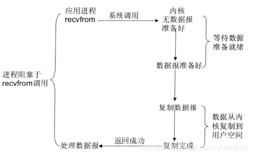

## Q1: 进程切换

为了控制进程的执行，内核必须有能力挂起正在CPU上运行的进程，并恢复以前挂起的某个进程的执行。这种行为被称为进程切换。因此可以说，任何进程都是在操作系统内核的支持下运行的，是与内核紧密相关的。

从一个进程的运行转到另一个进程上运行，这个过程中经过下面这些变化：
1. 保存处理机上下文，包括程序计数器和其他寄存器。
2. 更新PCB信息。
3. 把进程的PCB移入相应的队列，如就绪、在某事件阻塞等队列。
4. 选择另一个进程执行，并更新其PCB。
5. 更新内存管理的数据结构。
6. 恢复处理机上下文。

## Q2: I/O 

- I/O 模式
  - 刚才说了，对于一次IO访问（以read举例），数据会先被拷贝到操作系统内核的缓冲区中，然后才会从操作系统内核的缓冲区拷贝到应用程序的地址空间。所以说，当一个read操作发生时，它会经历两个阶段：
    1. 等待数据准备 (Waiting for the data to be ready)
    2. 将数据从内核拷贝到进程中 (Copying the data from the kernel to the process)

    正是因为这两个阶段，linux系统产生了下面五种网络模式的方案。
    - 阻塞 I/O（blocking IO）
      - 在linux中，默认情况下所有的socket都是blocking，一个典型的读操作流程大概是这样：
        
      - 当用户进程调用了recvfrom这个系统调用，kernel就开始了IO的第一个阶段：准备数据（对于网络IO来说，很多时候数据在一开始还没有到达。比如，还没有收到一个完整的UDP包。这个时候kernel就要等待足够的数据到来）。这个过程需要等待，也就是说数据被拷贝到操作系统内核的缓冲区中是需要一个过程的。而在用户进程这边，整个进程会被阻塞（当然，是进程自己选择的阻塞）。当kernel一直等到数据准备好了，它就会将数据从kernel中拷贝到用户内存，然后kernel返回结果，用户进程才解除block的状态，重新运行起来。
      - 所以，blocking IO的特点就是在IO执行的两个阶段都被block了
    - 非阻塞 I/O（nonblocking IO）
      - linux下，可以通过设置socket使其变为non-blocking。当对一个non-blocking socket执行读操作时，流程是这个样子：
        
      - 当用户进程发出read操作时，如果kernel中的数据还没有准备好，那么它并不会block用户进程，而是立刻返回一个error。从用户进程角度讲 ，它发起一个read操作后，并不需要等待，而是马上就得到了一个结果。用户进程判断结果是一个error时，它就知道数据还没有准备好，于是它可以再次发送read操作。一旦kernel中的数据准备好了，并且又再次收到了用户进程的system call，那么它马上就将数据拷贝到了用户内存，然后返回。
      - 所以，nonblocking IO的特点是用户进程需要不断的主动询问kernel数据好了没有。
    - I/O 多路复用（ IO multiplexing）
      - IO multiplexing就是我们说的select，poll，epoll，有些地方也称这种IO方式为event driven IO。select/epoll的好处就在于单个process就可以同时处理多个网络连接的IO。它的基本原理就是select，poll，epoll这个function会不断的轮询所负责的所有socket，当某个socket有数据到达了，就通知用户进程。
         
      - 当用户进程调用了select，那么整个进程会被block，而同时，kernel会“监视”所有select负责的socket，当任何一个socket中的数据准备好了，select就会返回。这个时候用户进程再调用read操作，将数据从kernel拷贝到用户进程。

      - 所以，I/O 多路复用的特点是通过一种机制一个进程能同时等待多个文件描述符，而这些文件描述符（套接字描述符）其中的任意一个进入读就绪状态，select()函数就可以返回。

      - 这个图和blocking IO的图其实并没有太大的不同，事实上，还更差一些。因为这里需要使用两个system call (select 和 recvfrom)，而blocking IO只调用了一个system call (recvfrom)。但是，用select的优势在于它可以同时处理多个connection。

      - 所以，如果处理的连接数不是很高的话，使用select/epoll的web server不一定比使用multi-threading + blocking IO的web server性能更好，可能延迟还更大。select/epoll的优势并不是对于单个连接能处理得更快，而是在于能处理更多的连接。）

      - 在IO multiplexing Model中，实际中，对于每一个socket，一般都设置成为non-blocking，但是，如上图所示，整个用户的process其实是一直被block的。只不过process是被select这个函数block，而不是被socket IO给block。


    - 信号驱动 I/O（ signal driven IO）


    - 异步 I/O（asynchronous IO）
      - Linux下的asynchronous IO其实用得很少。先看一下它的流程：
      
      - 用户进程发起read操作之后，立刻就可以开始去做其它的事。而另一方面，从kernel的角度，当它受到一个asynchronous read之后，首先它会立刻返回，所以不会对用户进程产生任何block。然后，kernel会等待数据准备完成，然后将数据拷贝到用户内存，当这一切都完成之后，kernel会给用户进程发送一个signal，告诉它read操作完成了。

- 总结
  - blocking和non-blocking的区别
    - 调用blocking IO会一直block住对应的进程直到操作完成，而non-blocking IO在kernel还准备数据的情况下会立刻返回。

  - synchronous IO和asynchronous IO的区别
    - 在说明synchronous IO和asynchronous IO的区别之前，需要先给出两者的定义。POSIX的定义是这样子的：
      - A synchronous I/O operation causes the requesting process to be blocked until that I/O operation completes;
      - An asynchronous I/O operation does not cause the requesting process to be blocked;

    - 两者的区别就在于synchronous IO做”IO operation”的时候会将process阻塞。按照这个定义，之前所述的blocking IO，non-blocking IO，IO multiplexing都属于synchronous IO。
    - non-blocking IO和asynchronous IO的区别还是很明显的。在non-blocking IO中，虽然进程大部分时间都不会被block，但是它仍然要求进程去主动的check，并且当数据准备完成以后，也需要进程主动的再次调用recvfrom来将数据拷贝到用户内存。而asynchronous IO则完全不同。它就像是用户进程将整个IO操作交给了他人（kernel）完成，然后他人做完后发信号通知。在此期间，用户进程不需要去检查IO操作的状态，也不需要主动的去拷贝数据
      


## Q3: EPOLL,SELECT,POLL

select，poll，epoll都是IO多路复用的机制。I/O多路复用就是通过一种机制，一个进程可以监视多个描述符，一旦某个描述符就绪（一般是读就绪或者写就绪），能够通知程序进行相应的读写操作。但select，poll，epoll本质上都是同步I/O，因为他们都需要在读写事件就绪后自己负责进行读写，也就是说这个读写过程是阻塞的，而异步I/O则无需自己负责进行读写，异步I/O的实现会负责把数据从内核拷贝到用户空间。（这里啰嗦下）

- Select


    `int select (int n, fd_set *readfds, fd_set *writefds, fd_set *exceptfds, struct timeval *timeout);`
    - select 函数监视的文件描述符分3类，分别是writefds、readfds、和exceptfds。调用后select函数会阻塞，直到有描述副就绪（有数据 可读、可写、或者有except），或者超时（timeout指定等待时间，如果立即返回设为null即可），函数返回。当select函数返回后，可以 通过遍历fdset，来找到就绪的描述符。

    - select目前几乎在所有的平台上支持，其良好跨平台支持也是它的一个优点。select的一 个缺点在于单个进程能够监视的文件描述符的数量存在最大限制，在Linux上一般为1024，可以通过修改宏定义甚至重新编译内核的方式提升这一限制，但 是这样也会造成效率的降低。

- poll

    `int poll (struct pollfd *fds, unsigned int nfds, int timeout);`
    - 不同与select使用三个位图来表示三个fdset的方式，poll使用一个 pollfd的指针实现。
    - pollfd结构包含了要监视的event和发生的event，不再使用select“参数-值”传递的方式。同时，pollfd并没有最大数量限制（但是数量过大后性能也是会下降）。 和select函数一样，poll返回后，需要轮询pollfd来获取就绪的描述符。

- epoll
  - epoll是在2.6内核中提出的，是之前的select和poll的增强版本。相对于select和poll来说，epoll更加灵活，没有描述符限制。epoll使用一个文件描述符管理多个描述符，将用户关系的文件描述符的事件存放到内核的一个事件表中，这样在用户空间和内核空间的copy只需一次。

  - 操作过程
  ```c++
  int epoll_create(int size)；//创建一个epoll的句柄，size用来告诉内核这个监听的数目一共有多大
  int epoll_ctl(int epfd, int op, int fd, struct epoll_event *event)；
  int epoll_wait(int epfd, struct epoll_event * events, int maxevents, int timeout);
  ```

1. ` int epoll_create(int size);`

   - 创建一个epoll的句柄，size用来告诉内核这个监听的数目一共有多大，这个参数不同于select()中的第一个参数，给出最大监听的fd+1的值，参数size并不是限制了epoll所能监听的描述符最大个数，只是对内核初始分配内部数据结构的一个建议。当创建好epoll句柄后，它就会占用一个fd值，在linux下如果查看/proc/进程id/fd/，是能够看到这个fd的，所以在使用完epoll后，必须调用close()关闭，否则可能导致fd被耗尽。

2. `int epoll_ctl(int epfd, int op, int fd, struct epoll_event *event)；`
函数是对指定描述符fd执行op操作。
   - epfd：是epoll_create()的返回值。
   - op：表示op操作，用三个宏来表示：添加EPOLL_CTL_ADD，删除EPOLL_CTL_DEL，修改EPOLL_CTL_MOD。分别添加、删除和修改对fd的监听事件。
   - fd：是需要监听的fd（文件描述符）
   - epoll_event：是告诉内核需要监听什么事，struct epoll_event结构如下：

3. `int epoll_wait(int epfd, struct epoll_event * events, int maxevents, int timeout);`

   - 等待epfd上的io事件，最多返回maxevents个事件。
   - 参数events用来从内核得到事件的集合，maxevents告之内核这个events有多大，这个maxevents的值不能大于创建epoll_create()时的size，参数timeout是超时时间（毫秒，0会立即返回，-1将不确定，也有说法说是永久阻塞）。该函数返回需要处理的事件数目，如返回0表示已超时。

- Epoll 工作模式
  - epoll对文件描述符的操作有两种模式：LT（level trigger）和ET（edge trigger）。LT模式是默认模式，LT模式与ET模式的区别如下：
    - LT模式：当epoll_wait检测到描述符事件发生并将此事件通知应用程序，应用程序可以不立即处理该事件。下次调用epoll_wait时，会再次响应应用程序并通知此事件。
        - LT(level triggered)是缺省的工作方式，并且同时支持block和no-block socket.在这种做法中，内核告诉你一个文件描述符是否就绪了，然后你可以对这个就绪的fd进行IO操作。如果你不作任何操作，内核还是会继续通知你的。
    - ET模式：当epoll_wait检测到描述符事件发生并将此事件通知应用程序，应用程序必须立即处理该事件。如果不处理，下次调用epoll_wait时，不会再次响应应用程序并通知此事件。
      - ET(edge-triggered)是高速工作方式，只支持no-block socket。在这种模式下，当描述符从未就绪变为就绪时，内核通过epoll告诉你。然后它会假设你知道文件描述符已经就绪，并且不会再为那个文件描述符发送更多的就绪通知，直到你做了某些操作导致那个文件描述符不再为就绪状态了(比如，你在发送，接收或者接收请求，或者发送接收的数据少于一定量时导致了一个EWOULDBLOCK 错误）。但是请注意，如果一直不对这个fd作IO操作(从而导致它再次变成未就绪)，内核不会发送更多的通知(only once)


- 进程，线程和协程的区别
- 虚拟内存，常驻内存和共享内存区别
- 内存缺页中断
- 进程间通信方式
- Unix系统中管道用什么机制
- fork
- 同步和异步
- 并行和并发的区别

- 父进程占4G存储空间，那么fork的子进程占多少？